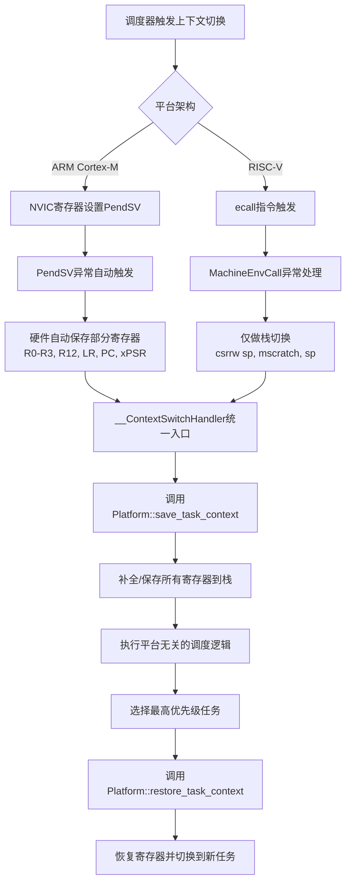
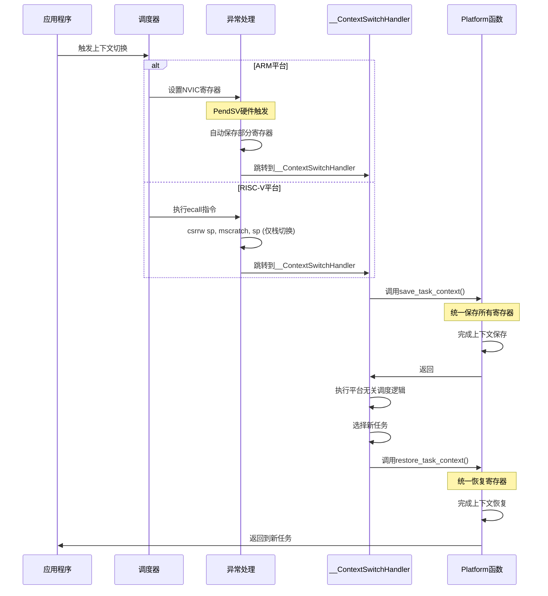

# Embassy Preempt 上下文切换架构设计

## 🎯 核心设计原则

**所有平台的寄存器保存都在进入`__ContextSwitchHandler`函数中通过`save_task_context()`统一完成**

## 📋 正确的架构流程图



## 🔍 详细时序图



## ✅ 关键设计正确性验证

### 1. 统一的入口点
```rust
// 两个平台最终都进入相同的函数
#[unsafe(no_mangle)]
extern "C" fn __ContextSwitchHandler() {
    // 1. 统一调用平台相关的上下文保存
    unsafe {
        embassy_preempt_platform::PlatformImpl::save_task_context();
    }

    // 2. 执行平台无关的调度逻辑
    let global_executor = GlobalSyncExecutor().as_ref().unwrap();
    // ... 调度算法
}
```

### 2. RISC-V异常入口的最小化设计
```assembly
# 正确：只做栈切换，不保存寄存器
MachineEnvCall:
    csrrw sp, mscratch, sp    # 仅切换栈指针
    j __ContextSwitchHandler # 跳转到统一处理函数
```

### 3. ARM和RISC-V的一致性保证
- **ARM**: PendSV + 部分硬件保存 + `save_task_context()`补全
- **RISC-V**: ecall + 栈切换 + `save_task_context()`完整保存
- **结果**: 两个平台都以相同状态进入调度器
