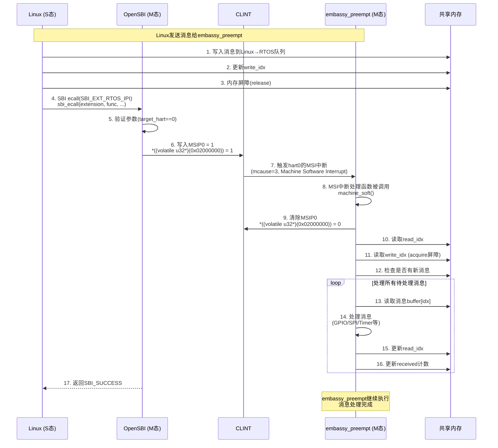
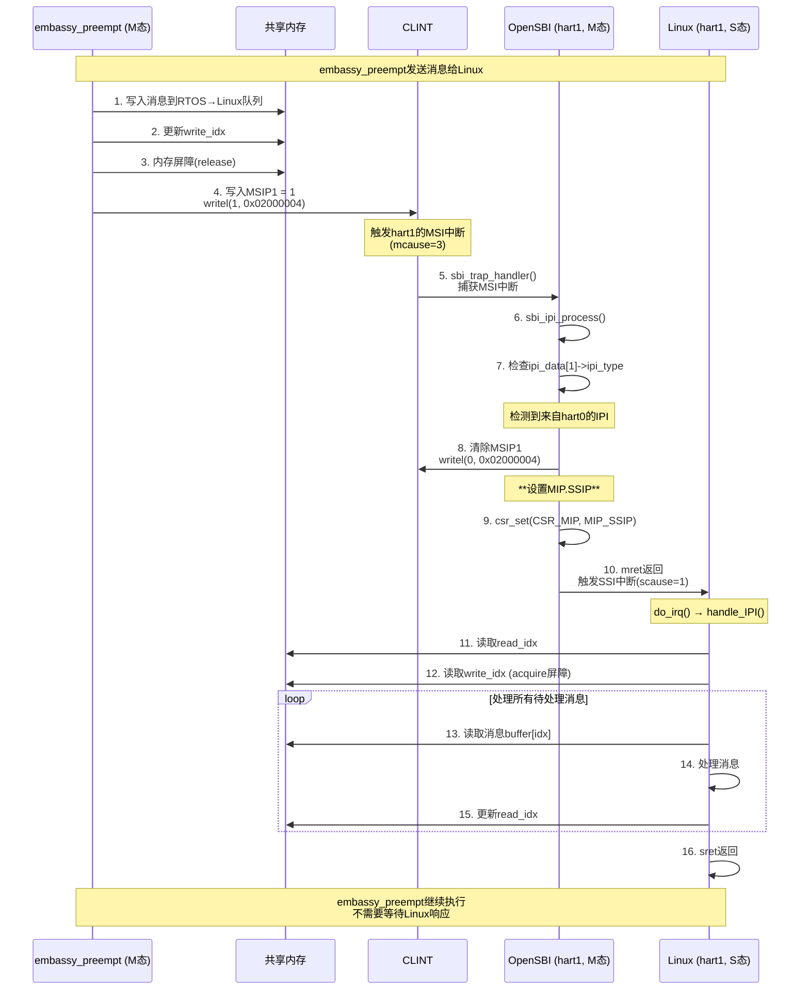

# JH7110多系统间通讯设计

**JH7110 hart0**：hart0不支持S态，只能运行在M态

因此采用以下架构：
- **hart0 (M态)**: embassy_preempt RTOS
- **hart1-4 (S态)**: Linux/StarryOS

## 系统架构

**JH7110非对称多处理器配置**：
- **hart0**: embassy_preempt独占M态（无OpenSBI层）
- **hart1-4**: 标准配置（OpenSBI M态 + Linux S态）

```
┌─────────────────────────────────────────────────────────────────┐
│                    JH7110 SoC                                   │
├─────────────────────────────────────────────────────────────────┤
│  hart0                    │  hart1-4                           │
│  ┌──────────────────┐     │  ┌──────────────────────────────┐  │
│  │embassy_preempt   │     │  │ OpenSBI (M态)                │  │
│  │     (M态)        │     │  │                              │  │
│  │                  │     │  │ ┌──────────────────────────┐ │  │
│  │ ┌──────────────┐ │     │  │  │SBI扩展                  │ │  │
│  │ │直接硬件访问  │ │     │  │  │- hart0 MSIP0操作        │ │  │
│  │ │- CLINT读写   │ │     │  │  │- 跨hart通信             │ │  │
│  │ │- MSIP0中断   │ │     │  │  │- 权限验证              │ │  │
│  │ │- 消息处理    │ │     │  │  └──────────────────────────┘ │  │
│  │ └──────────────┘ │     │  └──────────────────────────────┘  │
│  └──────────────────┘     │              ↓                      │
│         ↓                 │  ┌──────────────────────────────┐  │
│                           │  │ Linux (S态)                  │  │
│                           │  │                              │  │
│                           │  │ ┌──────────────────────────┐ │  │
│                           │  │  │SSI中断处理              │ │  │
│                           │  │  │- 检查共享内存          │ │  │
│                           │  │  │- 消息处理              │ │  │
│                           │  │  │- SBI调用               │ │  │
│                           │  │  └──────────────────────────┘ │  │
│                           │  └──────────────────────────────┘  │
│         ↕                  │              ↓                      │
│  ┌──────────────────┐     │  ┌──────────────────────────────┐  │
│  │ 共享内存访问     │◄────┼──┼─ 共享内存访问                │  │
│  │ - 消息队列       │     │  │ - 消息队列                   │  │
│  │ - 同步原语       │     │  │ - 同步原语                   │  │
│  └──────────────────┘     │  └──────────────────────────────┘  │
└─────────────────────────────────────────────────────────────────┘
                          ↓
               ┌─────────────────────┐
               │   CLINT (0x02000000) │
               │   MSIP0-4 寄存器     │
               │   中断委托(mideleg)  │
               └─────────────────────┘

中断流向：
• Linux → SBI ecall → OpenSBI设置MSIP0 → embassy_preempt MSI中断
• embassy_preempt → MSIP1-4 → Linux SSIP中断（通过mideleg委托）
```

## IPI通信机制

### 场景1: Linux → OpenSBI → embassy_preempt



---

### 场景2: embassy_preempt → Linux（完整流程）



---

## 共享内存设计

### 内存布局

```

┌────────────────────────────────────────┐
│  magic number和版本 (16 bytes)         │
├────────────────────────────────────────┤
│  Linux → RTOS 消息队列 (8KB)           │
│  - 环形缓冲区                           │
│  - 读/写索引                           │
│  - 消息计数                            │
├────────────────────────────────────────┤
│  RTOS → Linux 消息队列 (8KB)           │
│  - 环形缓冲区                           │
│  - 读/写索引                           │
│  - 消息计数                            │
├────────────────────────────────────────┤
│  同步和状态区域 (8KB)                  │
│  - 原子标志位                           │
│  - 心跳计数器                          │
│  - 错误状态                            │
├────────────────────────────────────────┤
│  大数据传输区 (40KB)                   │
│  - 用于传递大数据块                     │
└────────────────────────────────────────┘
```

### 消息队列结构

```rust
#[repr(C)]
struct SharedMessageQueue {
    // 魔数用于验证共享内存初始化
    magic: AtomicU32,        // 0xDEADBEEF
    version: AtomicU32,      // 版本号

    // Linux → RTOS 队列
    linux_to_rtos: MessageQueue,

    // RTOS → Linux 队列
    rtos_to_linux: MessageQueue,

    // 同步原语
    sync: SyncFlags,
}

#[repr(C)]
struct MessageQueue {
    // 环形缓冲区
    buffer: [Message; 256],  // 每个消息32字节

    // 读写索引
    read_idx: AtomicU16,
    write_idx: AtomicU16,

    // 消息计数
    count: AtomicU16,

    // 统计信息
    sent: AtomicU64,      // 发送消息总数
    received: AtomicU64,  // 接收消息总数
    dropped: AtomicU64,   // 丢弃消息数
}

#[repr(C)]
struct Message {
    msg_type: u32,        // 消息类型
    length: u32,          // 数据长度
    timestamp: u64,       // 时间戳
    data: [u8; 16],       // 小数据内联
}

#[repr(C)]
struct SyncFlags {
    // IPI触发标志
    linux_pending: AtomicBool,   // Linux有待处理消息
    rtos_pending: AtomicBool,    // RTOS有待处理消息

    // 心跳
    linux_heartbeat: AtomicU64,
    rtos_heartbeat: AtomicU64,

    // 状态
    linux_ready: AtomicBool,
    rtos_ready: AtomicBool,

    // 错误计数
    linux_errors: AtomicU32,
    rtos_errors: AtomicU32,
}
```