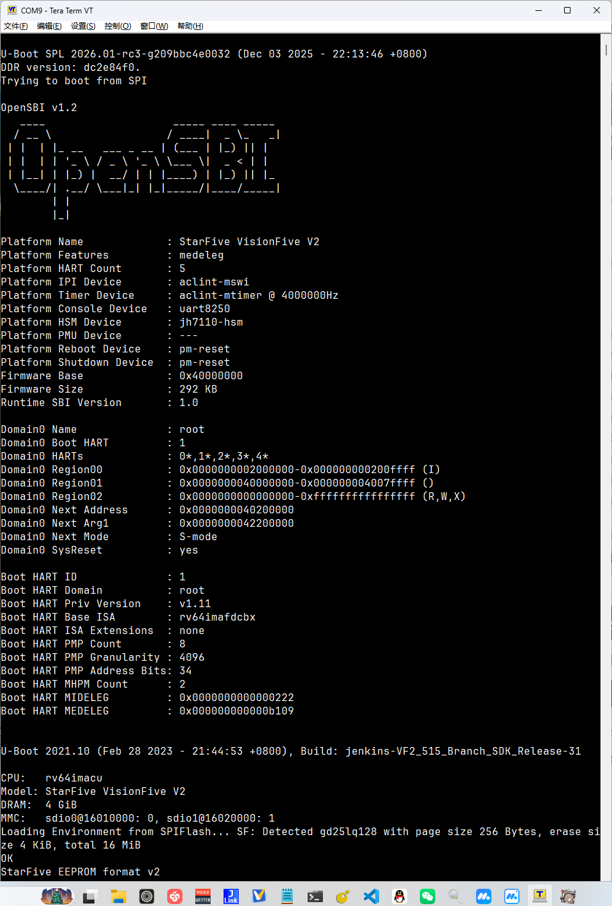

# 第六周工作总结

## Embassy 移植复现

- **串口烧录**: 通过串口烧录`https://github.com/liu0fanyi/async-summary`中提供的固件成功复现embassy移植

## 星光二平台调试

- **J-link调试尝试**: 串口调试的方式测试程序手段过于不自由，查找网上资料找到有J-link调试的先例
- **当下结果**: 成功用J-link连接`U74`大核，可能是因为`u-boot`时小核已经休眠，无法找到
- **下一步**: 使用社区开源方案（比官方sdk先进）`u-boot+opensbi`编译固件，手动修改`u-boot`，在`u-boot`阶段阻塞小核，使`J-link`连接上

社区的方案在`spl`阶段就已经初始化`J-tag`端口，而官方在`u-boot`阶段做这个操作
本项目的目标是将RTOS在S76小核上替换u-boot，所以使用开源社区的上游`u-boot`是正确的

## 固件编译

- **编译固件**: 使用官方`opensbi`+上游`u-boot`编译出spl固件，烧录到芯片后成功显示日志

## 学习平台以及启动阶段相关知识

### 相关资料
- [[记录] Boot JH7110 From Scratch](https://bbs.scumaker.org/t/topic/465)
- [昉·星光 2单板计算机软件技术参考手册](https://doc.rvspace.org/VisionFive2/PDF/VisionFive2_SW_TRM.pdf)
- [RVspace 昉·星光 2常见问题集](https://doc.rvspace.org/VisionFive2/FAQ/VisionFive_2/j_link.html)
- [昉·星光 2单板计算机快速参考手册](https://doc.rvspace.org/VisionFive2/PDF/VisionFive2_QSG.pdf)
- [社区帖子-JTAG ports?](https://forum.rvspace.org/t/jtag-ports/890)