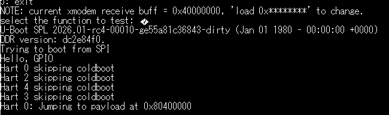
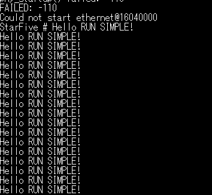

# 第十周工作总结

## 完善opensbi中的跳转函数，单独的hart0使用jump_to_payload函数跳转至0x80400000

```c
	if (coldboot)
		init_coldboot(scratch, hartid);
	else {
		sbi_printf("Hart %u skipping coldboot\n", hartid);
		if (current_hartid() == 0) {
			/* Flush instruction cache before jumping */
			RISCV_FENCE_I;

			/* Set MPP to Machine mode for next mret */
			csr_write(CSR_MSTATUS,
				 (csr_read(CSR_MSTATUS) & ~MSTATUS_MPP) |
				 (PRV_M << MSTATUS_MPP_SHIFT));

			sbi_printf("Hart 0: Jumping to payload at 0x80400000\n");

			/* Jump to payload with hart_id=0, opaque=0 */
			jump_to_payload(0x80400000, 0, 0);

			/* Should never reach here */
			sbi_hart_hang();
		} else {
			init_warmboot(scratch, hartid);
		}
	}
```

关于jump_to_payload函数

```c
static void __attribute__((naked)) jump_to_payload(unsigned long entry,
						    unsigned long hart_id,
						    unsigned long opaque)
{
	__asm__ __volatile__(
		"csrw	mepc, a0\n"	/* Save entry address to mepc */
		"mv	a0, a1\n"	/* a0 = hart_id (first arg for payload) */
		"mv	a1, a2\n"	/* a1 = opaque (second arg for payload) */
		"mret"		/* Jump to payload */
	);
}
```

其两个参数可以在后续系统中使用到


## 参考[async-summary](https://github.com/liu0fanyi/async-summary)的串口驱动，在embassy_preempt中编写
成功进行打印输出

如图跳转成功




在串口中输出文本成功


