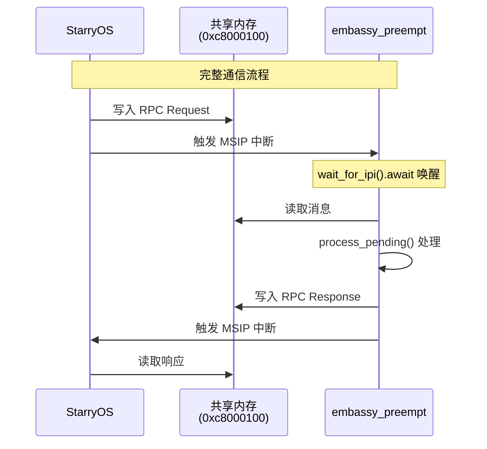

# 第十七周工作总结

## 概述

本周完成了 **embassy_preempt** 与 **StarryOS** 双系统间的双向通信机制实现，包括 Notification（通知）和 RPC（远程过程调用）两种通信模式。为此新建了 `ov-channal` 通信库

## 核心工作

### 1. ov-channal 通信库

**仓库**：[ov-channal](https://github.com/Oveln/ov_channal)

**功能**：
- 基于环形缓冲区的无锁通信
- 四种消息类型：Notification、Data、RPC Request/Response
- RPC 支持：使用 postcard 二进制序列化

**内存布局**：
```
共享内存基地址: 0xc8000100

┌──────────────────────────────────────────────────────────────┐
│                    SharedMemory                              │
├──────────────────────────────┬───────────────────────────────┤
│         Channel 0            │           Channel 1           │
│      (StarryOS → RTOS)       │       (RTOS → StarryOS)       │
└──────────────────────────────┴───────────────────────────────┘

每个 Message: 256 字节
- kind (1B): 消息类型
- payload (255B): 数据内容
```

### 2. StarryOS：IPI 设备增强

**提交**：`873e63d` - ipi设备支持notification, rpc函数调用

**功能**：
- 在原有 IPI 设备基础上增加了 RPC 函数调用支持
- 实现 notification 消息类型
- 添加 RPC request/response 消息处理

### 3. embassy_preempt：IPI 等待机制

**提交**：`5101a6f` - 添加：内核提供服务，wait_for_ipi()

**功能**：
- 新增 `wait_for_ipi()` 异步接口，任务可以 await 等待 IPI
- 实现 IPI 等待队列管理（最多 4 个任务同时等待）
- IPI 回调机制：收到中断后唤醒所有等待任务并触发上下文切换

**实现**：
```rust
pub fn wait_for_ipi() -> IpiWait  // 创建 IPI 等待 Future
pub(crate) fn ipi_callback()      // IPI 中断回调
pub(crate) fn init()              // 注册 IPI 回调到平台层
```

**内核中流程**：
```
wait_for_ipi().await
      │
      ├─→ 首次 poll: 注册任务到 IPI 等待列表
      │       └─→ single_poll: 从就绪队列移除
      │
      └─→ MSIP 中断（来自另一个 hart）
              └─→ ipi_callback()
                      ├─→ 唤醒等待列表中的所有任务
                      └─→ IntCtxSW() → 上下文切换
                              └─→ 任务恢复：poll 返回 Ready
```

### 4. embassy_preempt_app_Visionfive2

**仓库**：新增子模块 `embassy_preempt_app_Visionfive2`

**提交**：`c9283b5` - feat: rpc服务器功能，能够响应 StarryOS 方发来的 rpc request 和 notifcation

**功能**：
- 基于 `ov-channal` 库实现共享内存通信（基地址：0xc8000100）
- 实现 RPC 服务器，实现了 `hello` 和 `add(x,y)`
- Notification 回显
- 双通道通信：
  - Channel 0: StarryOS → embassy_preempt
  - Channel 1: embassy_preempt → StarryOS

**支持的 RPC Methods**：
| Method ID | 名称 | 功能 |
|-----------|------|------|
| 0 | HELLO_WORLD | 测试方法，返回 0 |
| 1 | ADD | 加法运算，接收 (i32, i32)，返回和 |

**模块**：
```rust
// src/intercom.rs (新增文件，133行)
pub fn init()              // 初始化共享内存
pub fn has_pending()       // 检查是否有待处理消息
pub fn process_pending()   // 处理所有待处理消息
pub fn send_notification() // 发送通知到 StarryOS
```

**任务示例**：
```rust
async fn task7(_args: *mut c_void) {
    loop {
        // 等待来自 StarryOS 的 IPI
        embassy_preempt_executor::ipi::wait_for_ipi().await;
        // 处理待处理消息
        intercom::process_pending();
    }
}
```

### 5. 主仓库：构建系统更新

**提交**：`c7ce277` - 支持双系统间：notifcation, rpc

**变更**：
- 添加 `embassy_preempt_app_Visionfive2` 子模块
- 更新 Makefile：
  - 新的应用目录路径
  - 默认 SBI 从 rustsbi 改为 opensbi

## 技术架构

### RPC 通信流程



### 依赖关系

```
ov-channal (通信库)
    ↑           ↑
    │           │
StarryOS   embassy_preempt_app
    │           │
    │    embassy_preempt (wait_for_ipi)
    │           │
    └───────────┘
      双系统通信
```

## 参考资料

- [ov-channal 通信库](https://github.com/Oveln/ov_channal)
