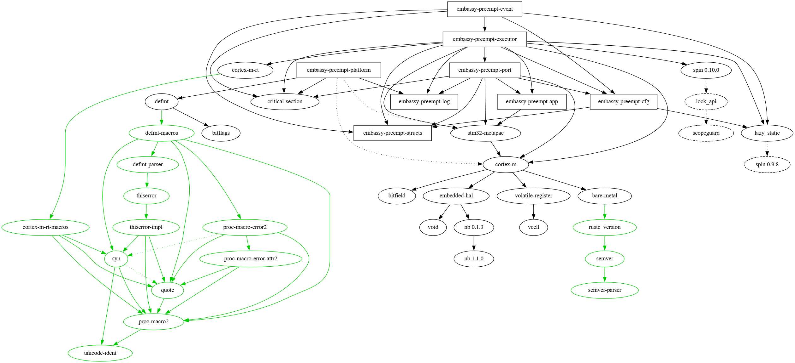
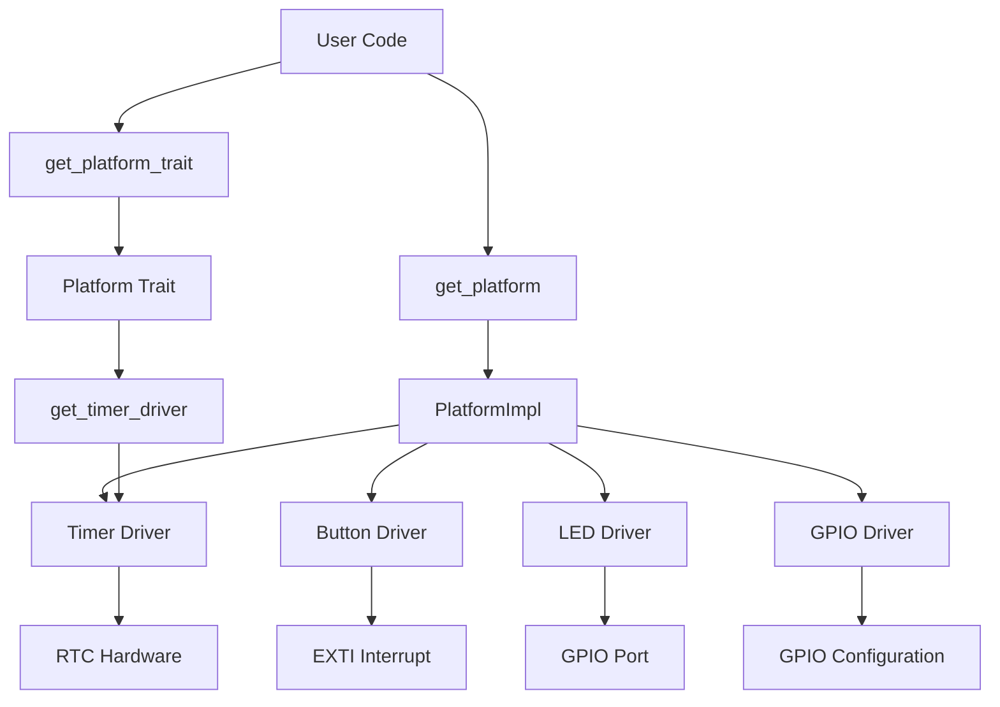

# Embassy Preempt RTOS 技术报告

## 1. 引言

### 1.1 项目背景

本项目基于原有的Embassy Preempt RTOS进行重构和扩展。原项目虽然具备基本的实时调度功能，但在架构设计上存在以下限制：

- **单一平台依赖**: 原代码与ARM Cortex-M架构紧密耦合，难以扩展到其他处理器架构
- **模块耦合度高**: 各功能模块间边界不清晰，依赖关系复杂
- **硬件抽象不足**: 缺乏统一的硬件抽象层，平台特定代码散布在各个模块中
- **可维护性差**: 代码结构不够清晰，难以进行二次开发和功能扩展

### 1.2 项目目标

基于上述背景，在阅读代码的过程中我定了以下目标：

- **设计跨平台的嵌入式RTOS**: 支持ARM Cortex-M和RISC-V等多种主流微控制器架构
- **实现高可扩展性的模块化架构**: 通过模块化设计降低耦合度，提升代码可维护性
- **建立统一的硬件抽象层**: 为不同平台提供一致的编程接口
- **保持零成本抽象**: 在提供抽象的同时不牺牲运行时性能
- **完善异步编程模型**: 在嵌入式环境中高效应用Rust的async/await机制

## 2. 系统架构设计

### 2.1 整体架构重构：从单体到模块化

#### 2.1.1 项目拆分的根本原因

**原架构问题分析**：
原有的Embassy Preempt项目采用了相对单一的整体架构，主要存在以下问题：

1. **平台耦合度过高**
   - ARM Cortex-M特定代码（如PendSV中断、NVIC配置）直接嵌入在核心调度逻辑中
   - 硬件相关代码与业务逻辑混杂，难以进行架构无关的单元测试
   - 扩展到新架构需要修改核心代码，违背开闭原则

2. **模块边界不清晰**
   - 调度器、内存管理、外设驱动等模块间存在循环依赖
   - 缺乏清晰的接口定义，模块间直接访问内部实现
   - 代码复用性差，功能重复实现

3. **可维护性不足**
   - 修改一个功能可能影响多个不相关的模块
   - 新功能添加困难，需要考虑对现有架构的影响
   - 调试和问题定位复杂，错误传播路径不清晰

**拆分策略与设计原则**：

基于以上问题，我采用了以下模块化重构方案：

```rust
// 重构前：平台相关代码散布在调度器中
#[no_mangle]
pub unsafe extern "C" fn PendSV_Handler() {
    // ARM特定的寄存器操作与调度逻辑混合
    asm!(
        "MRS R0, PSP",
        "STMDB R0!, {{R4-R11}}",
        // ... 大量ARM特定汇编代码
    );

    // 调度逻辑
    if high_ready_task != current_task {
        // 任务切换逻辑
    }
    // 上下文切换代码
}

// 重构后：通过平台抽象层分离
pub fn trigger_context_switch() {
    get_platform_trait().trigger_context_switch();  // 平台无关调用
}

// 平台实现中处理硬件特定逻辑
impl Platform for Stm32Platform {
    fn trigger_context_switch(&'static self) {
        const NVIC_INT_CTRL: u32 = 0xE000ED04;
        const NVIC_PENDSVSET: u32 = 0x10000000;
        unsafe {
            asm!("STR R1, [R0]",
                 in("r0") NVIC_INT_CTRL,
                 in("r1") NVIC_PENDSVSET);
        }
    }
}
```

**核心设计原则**：

1. **单一职责原则**: 每个模块只负责一个明确的功能领域
2. **依赖倒置原则**: 高层模块不依赖低层模块，都依赖抽象
3. **接口隔离原则**: 客户端不应依赖它不需要的接口
4. **零成本抽象**: 编译时抽象，运行时无额外开销

#### 2.1.2 新模块化架构

重构后的模块化架构实现了清晰的职责分离：

```
embassy-preempt/
├── embassy-preempt-executor     # 执行器核心 - 平台无关的调度逻辑
├── embassy-preempt-platform     # 平台抽象层 - 硬件抽象与驱动集成
├── embassy-preempt-macros       # 统一入口宏 - 跨平台入口点抽象
├── embassy-preempt-log          # 独立日志系统
├── embassy-preempt-mem          # 内存管理 - 内存布局与分配策略
├── embassy-preempt-event        # 事件同步系统
├── embassy-preempt-structs      # 基础数据结构 - 跨模块共享的数据类型
└── embassy-preempt-cfg          # 配置管理 - 编译时配置系统
```

**模块依赖关系重构**：

重构前后的依赖关系对比：

优化前：

优化后：


**依赖关系优化**：
- **executor模块**: 完全平台无关，仅依赖Platform trait
- **platform模块**: 包含所有平台特定代码，向上提供统一接口

### 2.2 平台抽象层架构设计

#### 2.2.1 Platform Trait核心设计

平台抽象层的核心是`Platform` trait，它定义了RTOS所需的硬件操作接口：

```rust
// modules/embassy-preempt-platform/src/traits/platform.rs
pub trait Platform {
    type OsStk;  // 平台特定的栈类型

    // 核心RTOS操作 - 平台无关接口
    fn trigger_context_switch(&'static self);
    fn set_program_stack_pointer(&'static self, sp: *mut u8);
    fn configure_interrupt_stack(&'static self, interrupt_stack: *mut u8);
    fn init_task_stack(&'static self, stk_ref: NonNull<Self::OsStk>, executor_function: fn()) -> NonNull<Self::OsStk>;
    fn enter_idle_state(&'static self);
    fn shutdown(&'static self);

    // 上下文管理 - 强制内联
    #[inline(always)]
    unsafe fn save_task_context(&'static self);
    #[inline(always)]
    unsafe fn restore_task_context(&'static self, stack_pointer: *mut usize, interrupt_stack: *mut usize, return_value: u32);
    #[inline(always)]
    unsafe fn get_current_stack_pointer(&'static self) -> *mut usize;

    // 定时器驱动访问 - 异步调度基础
    fn get_timer_driver(&'static self) -> &'static dyn crate::traits::timer::Driver;
}
```

**设计特点分析**：

1. **关联类型设计**: `type OsStk` 允许不同平台定义不同的栈指针类型

2. **生命周期参数**: `&'static self` 确保平台实例在程序整个生命周期内有效，支持全局单例模式

3. **性能优化**: 性能关键的方法标记`#[inline(always)]`，确保零成本抽象

4. **类型擦除**: 返回trait对象 (`&dyn Driver`) 实现类型安全的运行时多态

#### 2.2.2 双重访问模式设计

为了平衡类型安全和灵活性，平台抽象层提供了两种不同的访问模式：

```rust
// modules/embassy-preempt-platform/src/lib.rs
use spin::Once;

static __PLATFORM: Once<chip::PlatformImpl> = Once::new();

// 方法一：具体类型访问 - 用于平台特定代码
pub fn get_platform() -> &'static chip::PlatformImpl {
    __PLATFORM.call_once(|| chip::PlatformImpl::new())
}

// 方法二：trait对象访问 - 用于平台无关代码
pub fn get_platform_trait() -> &'static dyn Platform<OsStk = OsStk> {
    __PLATFORM.call_once(|| chip::PlatformImpl::new()) as &dyn Platform<OsStk = OsStk>
}
```

**两种访问模式的区别与适用场景**：

| 访问方式 | 返回类型 | 适用场景 | 好处 | 限制 |
|---------|---------|----------|------|------|
| `get_platform()` | `&'static chip::PlatformImpl` | 平台特定代码、驱动开发 | 访问平台特有功能、编译时优化 | 跨平台兼容性差 |
| `get_platform_trait()` | `&'static dyn Platform<OsStk = OsStk>` | 由系统代码调用，仅使用trait中的方法 | 跨平台兼容、类型安全 | 运行时开销、无法访问平台特有功能 |

**实现原理**：

- **懒初始化**: 使用`spin::Once`确保平台实例只初始化一次
- **类型转换**: trait对象访问时进行类型擦除，牺牲少量性能换取跨平台兼容性
- **编译时优化**: 具体类型访问时编译器可以进行完整的优化

#### 2.2.3 多平台支持策略

**编译时平台选择与统一接口**：

Platform库通过`pub use`机制提供了强大的多平台支持，实现了路径导出的通用化：

```rust
// modules/embassy-preempt-platform/src/lib.rs
// 编译时平台选择 - 核心机制
#[cfg(feature = "stm32f401re")]
pub use arch::chip::stm32f401re as chip;

#[cfg(all(target_arch = "riscv32", feature = "qingke"))]
pub use arch::chip::ch32v208 as chip;

#[cfg(not(any(feature = "stm32f401re", feature = "qingke")))]
compile_error!("No platform selected. Use feature flags to specify target platform.");
```

**统一接口设计原理**：

`pub use`语句将特定平台的实现重新导出为统一的外部接口，实现了路径导出的通用化：

1. **用户代码路径统一**: 应用程序始终使用`chip::`和`arch::`路径访问平台特定功能
2. **编译时自动选择**: Rust编译器根据feature标志选择具体的平台实现
3. **类型安全保证**: 在编译时就能确保平台兼容性，避免运行时错误

**编译后的实际路径映射**：

根据不同的feature标志，编译器会将`chip::`路径映射到具体平台：

```rust
// 当编译时启用 stm32f401re feature：
// chip::PlatformImpl 实际解析为 arch::chip::stm32f401re::PlatformImpl

// 当编译时启用 qingke feature：
// chip::PlatformImpl 实际解析为 arch::chip::ch32v208::PlatformImpl
```

**扩展性设计**：

这种`pub use`机制具有良好的扩展性，添加新平台只需：

```rust
// 在lib.rs中添加新的平台支持
#[cfg(feature = "esp32")]
pub use arch::chip::esp32 as chip;

// 用户通过feature标志选择平台
// embassy-preempt-platform = { features = ["esp32"] }
```

**架构特定代码隔离**：

```
src/
├── arm/                      # ARM Cortex-M实现
│   ├── chip/                 # 芯片特定实现
│   │   └── stm32f401re/
│   │       ├── platform.rs   # Platform trait实现
│   │       ├── timer_driver.rs
│   │       └── ucstk.rs      # ARM栈上下文
│   └── driver/               # ARM特定驱动
├── riscv/                   # RISC-V实现（占位符）
│   ├── chip/
│   └── driver/
└── traits/                  # 平台无关trait定义
```

**驱动模型标准化**：

```rust
// 统一的定时器驱动trait
pub trait TimerDriver {
    fn now(&self) -> u64;
    unsafe fn allocate_alarm(&self) -> Option<AlarmHandle>;
    fn set_alarm_callback(&self, alarm: AlarmHandle, callback: fn(*mut ()), ctx: *mut ());
    fn set_alarm(&self, alarm: AlarmHandle, timestamp: u64) -> bool;
    unsafe fn on_interrupt(&self);
}

// 平台特定实现
impl TimerDriver for RtcDriver {
    fn now(&self) -> u64 {
        // STM32 RTC硬件特定实现
        // ....
    }
}
```

#### 2.2.4 驱动与PlatformImpl对象的关系设计

**驱动集成模式的核心思想**：

PlatformImpl作为驱动的容器和协调者，负责：
1. **驱动生命周期管理**: 初始化、配置和销毁驱动实例

**STM32F401RE平台的具体实现**：

```rust
// modules/embassy-preempt-platform/src/arm/chip/stm32f401re/platform.rs
pub struct PlatformImpl {
    // 驱动实例 - 通过Mutex保证线程安全
    pub timer: RtcDriver,
    pub button: RefCell<ButtonDriver>,     // 可借用访问
    pub led: RefCell<LedDriver>,           // 可借用访问
}

impl PlatformImpl {
    pub fn new() -> Self {
        // 初始化HAL实例
        let mut peripherals = Peripherals::take().unwrap();
        let mut core_peripherals = CorePeripherals::take().unwrap();

        // 初始化时钟系统
        let rcc = peripherals.RCC.constrain();
        let clocks = rcc
            .cfgr
            .use_hse(25.MHz())
            .sysclk(84.MHz())
            .freeze();

        // 创建驱动实例
        let timer = RtcDriver::new(&peripherals.RTC, &clocks);
        let button = ButtonDriver::new(peripherals.PC13);
        let led = LedDriver::new(peripherals.PA5);

        PlatformImpl {
            timer,
            button: RefCell::new(button),
            led: RefCell::new(led),
        }
    }
}
```

**中断处理与驱动协作**：

```rust
// 中断处理程序中的驱动访问
#[cortex_m_rt::interrupt]
pub fn EXTI15_10() {
    critical_section::with(|cs| {
        // 通过平台实例访问具体驱动
        let platform = embassy_preempt_platform::get_platform();
        let mut button = platform.button.borrow_mut(cs);

        // 处理按钮中断
        if button.handle_interrupt() {
            // 如果按钮被按下，唤醒等待的任务
            button.wake_waiting_task();
        }
    });
}

// 异步按钮驱动实现
impl ButtonDriver {
    pub fn wait_for_press(&self) -> impl Future<Output = ()> + '_ {
        struct ButtonWait<'a> {
            driver: &'a ButtonDriver,
        }

        impl Future for ButtonWait<'_> {
            type Output = ();

            fn poll(self: Pin<&mut Self>, cx: &mut Context<'_>) -> Poll<Self::Output> {
                if self.driver.is_pressed() {
                    Poll::Ready(())
                } else {
                    // 注册waker，等待中断唤醒
                    self.driver.register_waker(cx.waker());
                    Poll::Pending
                }
            }
        }

        ButtonWait { driver: self }
    }
}
```

**驱动层次结构设计**：



### 2.3 统一入口宏设计

#### 2.3.1 跨平台entry宏实现

**设计动机**：
原有的项目直接使用`cortex_m_rt::entry`宏，这导致了ARM架构特定的依赖。为了实现真正的跨平台支持需要一个架构无关的入口点抽象。

**宏实现原理**：

```rust
// modules/embassy-preempt-macros/src/lib.rs
#[proc_macro_attribute]
pub fn entry(_args: TokenStream, input: TokenStream) -> TokenStream {
    let expanded = quote::quote! {
        // ARM Cortex-M平台
        #[cfg(target_arch = "arm")]
        #[cortex_m_rt::entry]
        #input

        // RISC-V平台 (QingKe内核)
        #[cfg(all(target_arch = "riscv32", feature = "qingke"))]
        #[qingke_rt::entry]
        #input

        // 其他架构报错
        #[cfg(not(any(target_arch = "arm", all(target_arch = "riscv32", feature = "qingke"))))]
        compile_error!("Unsupported target architecture for embassy-preempt");
    };
    expanded.into()
}
```

**使用示例**：

```rust
// 用户代码 - 架构无关的入口点
#[embassy_preempt_macros::entry]
fn main() -> ! {
    // 初始化RTOS
    OSInit();

    // 创建应用任务
    create_user_tasks();

    // 启动调度器
    OSStart();
}

// 编译时根据目标架构展开为对应的特定入口宏
// ARM平台编译后等效于：
// #[cortex_m_rt::entry]
// fn main() -> ! { ... }

// RISC-V平台编译后等效于：
// #[qingke_rt::entry]
// fn main() -> ! { ... }
```

**编译时平台选择机制**：

通过Rust的条件编译系统，在编译时根据目标架构和feature标志选择合适的入口宏：

```toml
# Cargo.toml配置示例
[features]
default = ["stm32f401re"]
stm32f401re = []
ch32v208 = ["qingke"]
qingke = ["qingke-rt"]
```

## 3. 技术实现

### 3.1 内存管理系统优化

#### 3.1.1 栈布局优化设计

**栈溢出保护机制**：

通过将程序栈放置在中断栈下方，当程序栈溢出时会首先破坏中断栈，这会导致系统崩溃而不是静默的数据破坏，提高了系统的可调试性：

```rust
// 栈保护验证
impl Platform for PlatformImpl {
    fn configure_interrupt_stack(&'static self, interrupt_stack: *mut u8) {
        // 验证栈地址有效性
        let stack_limit = interrupt_stack as usize - self.config.interrupt_stack_size;

        unsafe {
            // 设置MSP（主栈指针）用于中断处理
            asm!("msr MSP, {}", in(reg) interrupt_stack);

            // 栈边界检查（可选，用于调试）
            if cfg!(debug_assertions) {
                assert!(stack_limit > 0x20000000, "Stack overflow detected");
            }
        }
    }
}
```

Todo: 在未来实现定期的栈溢出检查，这个想法来源于一次opt-level=0的痛苦栈溢出调试。

#### 3.1.2 内存配置统一化

**platform库统一提供memory.x**：

```rust
// modules/embassy-preempt-platform/build.rs
use std::env;
use std::fs;
use std::path::PathBuf;

fn main() {
    let out_dir = env::var_os("OUT_DIR").unwrap();
    let dest_path = PathBuf::from(out_dir).join("memory.x");

    // 根据feature生成对应的memory.x
    let memory_content = if cfg!(feature = "stm32f401re") {
        include_str!("arm/chip/stm32f401re/memory.x")
    } else if cfg!(feature = "ch32v208") {
        include_str!("riscv/chip/ch32v208/memory.x")
    } else {
        panic!("Unsupported platform: no memory configuration available");
    };

    fs::write(&dest_path, memory_content).unwrap();
    println!("cargo:rustc-link-search={}", out_dir);

    // 通知cargo重新编译
    println!("cargo:rerun-if-changed=build.rs");
}
```

### 3.2 HAL库集成与驱动重构

#### 3.2.1 外设驱动异步化

**异步使用示例**：

```rust
// 应用层使用异步按钮驱动
#[embassy_preempt_macros::entry]
async fn task1(_args: *mut c_void) {
    loop {
        critical_section::with(|cs| get_platform().led.borrow(cs).toggle());
        task_log!(info, "waiting for button");
        wait_for_button().await;
        task_log!(info, "button pressed");
    }
}
```

### 3.3 开发工具链优化

#### 3.3.1 依赖管理优化

**性能优化措施**：

在开发过程中，我对项目依赖进行了全面优化，主要改进包括：

1. **删除lazystatic依赖**：
   ```toml
   # 优化前
   lazy_static = { version = "1.4", features = ["spin_no_std"] }

   # 优化后
   spin = "0.10.0"
   ```

2. **统一spin版本**：
   - 使用`spin::Once`替代`lazy_static::lazy_static`
   - 减少编译时开销和运行时内存占用
   - 消除lazy_static版本过老，编译系统内同时存在`spin0.10.0`和`spin0.9.8`的问题

3. **defmt依赖解耦**：
   ```rust
   // modules/embassy-preempt-log/src/lib.rs
   #[cfg(feature = "defmt")]
   use defmt::{debug, error, info, warn};

   #[cfg(not(feature = "defmt"))]
   macro_rules! info {
       ($($arg:tt)*) => {};
   }
   ```

## 4. 跨平台适配实践

### 4.1 开源工具链贡献

**probe-rs集成**：

为CH32V208系列芯片开发了完整的烧录算法，并成功集成到probe-rs工具链中：

[ch32-rs PR #2](https://github.com/ch32-rs/flash-algorithms/pull/2)

```rust
// flash-algorithms/ch32v208/src/lib.rs
const FLASH_KEY1: u32 = 0x45670123;
const FLASH_KEY2: u32 = 0xCDEF89AB;

const ERASE_TIMEOUT: u32 = 0xF00000;

algorithm!(Algorithm, {
    device_name: "ch32v208",
    device_type: DeviceType::Onchip,
    flash_address: 0x0000_0000,
    flash_size: 0x10000,
    page_size: 0x100,
    // Note: This is not correct, each erased word looks like: 0xe339e339
    empty_value: 0x39,
    program_time_out: 1000,
    erase_time_out: 2000,
    sectors: [{
        size: 0x8000,
        address: 0x0000000,
    }]
});
```

**VSCode调试支持**：

基于probe-rs的调试支持，实现了VSCode中CH32V208的完整调试环境：

```json
// .vscode/launch.json
{
    "version": "0.2.0",
    "configurations": [
        {
            "preLaunchTask": "${defaultBuildTask}",
            "type": "probe-rs-debug",
            "request": "launch",
            "name": "CH32V208 Debug",
            "flashingConfig": {
                "flashingEnabled": true
            },
            "chip": "CH32V208",
            "coreConfigs": [
                {
                    "programBinary": "target/riscv32imac-unknown-none-elf/debug/ch32v208-blinky"
                }
            ]
        }
    ]
}
```

## 5 博客系统搭建

**VitePress技术文档**：

搭建了基于VitePress的技术博客系统：

```javascript
// blogs/.vitepress/config.mts
export default withMermaid(withSidebar(
  defineConfig({
    title: "Embassy Preempt 博客",
    description: "基于 Rust 的嵌入式异步实时操作系统技术博客",
    themeConfig: {
      // https://vitepress.dev/reference/default-theme-config
      nav: [
        { text: '首页', link: '/' },
        { text: '技术报告', link: '/技术报告/' },
        { text: '周报', link: '/周报-Oveln/' },
        { text: '项目计划', link: '/项目计划/项目计划-20251111'}
      ],

      socialLinks: [
        { icon: 'github', link: 'https://github.com/Oveln/embassy_preempt' }
      ]
    }
  }),
  {
    // 侧边栏配置
    excludeByGlobPattern: ['node_modules/**', '.vitepress/**', 'public/**'],
    // sortMenusOrderByDescending: true,  // 从新到旧排序
    sortMenusByFrontmatterDate: true,
    useTitleFromFrontmatter: true      // 从 frontmatter 获取标题
  }
))
```

**自动化部署**：

通过GitHub Actions实现了博客的自动化部署：

```yaml
# .github/workflows/deploy-blog.yml
jobs:
  build-and-deploy:
    runs-on: ubuntu-latest
    if: github.ref == 'refs/heads/main'

    steps:
    - name: Checkout
      uses: actions/checkout@v4
      with:
        fetch-depth: 0
        token: ${{ secrets.GITHUB_TOKEN }}

    - name: Setup Bun
      uses: oven-sh/setup-bun@v2
      with:
        bun-version: latest

    - name: Install dependencies
      working-directory: ./blogs
      run: bun install

    - name: Build VitePress site
      working-directory: ./blogs
      run: bun run build

    - name: Deploy to blog branch
      uses: peaceiris/actions-gh-pages@v4
      with:
        github_token: ${{ secrets.GITHUB_TOKEN }}
        publish_dir: ./blogs/.vitepress/dist
        publish_branch: blog
        force_orphan: true
```

## 6. 结论与展望

### 6.1 成果总结

经过四周的迭代开发，成功实现了以下核心目标：

1. **完整的模块化架构**: 将原单体项目重构为8个独立模块，实现了清晰的职责分离
2. **跨平台抽象层**: 建立了完善的Platform Trait抽象，支持ARM Cortex-M和RISC-V架构
3. **零成本抽象**: 通过编译时优化，确保抽象层不引入运行时性能损失
4. **统一的开发体验**: 提供了跨平台的entry宏和统一的驱动接口

### 6.2 创新点总结

**平台抽象层设计**：
- 双重访问模式（`get_platform()`和`get_platform_trait()`）平衡了类型安全和灵活性
- PlatformImpl作为驱动容器，实现了资源的统一管理
- 编译时平台选择，运行时零开销

**开源工具链贡献**：
- 为CH32V208系列芯片开发了完整的probe-rs支持
- 贡献了烧录算法和调试功能，推动了RISC-V嵌入式生态发展

### 6.3 经验教训

**架构设计的重要性**：
- 前期的架构规划对项目的可维护性和扩展性至关重要
- 模块化设计应该遵循单一职责和依赖倒置原则
- 抽象层设计需要平衡灵活性和性能