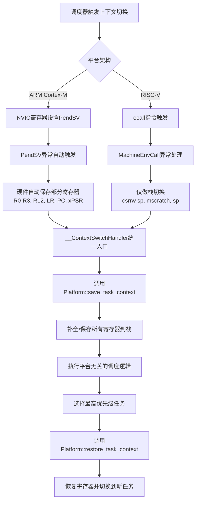

# Embassy Preempt RTOS 技术报告
## RISC-V平台支持与VisionFive2移植

## 一、RISC-V架构支持实现

### 1.1 CH32V307平台（Qingke架构）

#### 技术特点
- **芯片型号**: CH32V307WCU6
- **架构**: RISC-V32 (Qingke扩展指令集)
- **核心特性**: 不包含原生原子操作指令支持

#### 关键技术实现

**原子操作迁移至portable-atomic**
```toml
# 解决RISC-V平台原子指令支持不一致问题
dependencies.portable-atomic = { version = "1", features = ["critical-section"] }
```

- **问题背景**: 某些RISC-V平台不支持原生atomic指令
- **解决方案**: 使用`portable-atomic`库统一原子操作实现
- **特性控制**: 通过`portable-atomic/critical-section`特性选择实现方式
  - 启用时：使用portable-atomic的临界区实现
  - 未启用：继续使用汇编atomic实现

**任务调度实现**
- 成功在RISC-V平台上实现完整的任务调度功能
- 实现了平台无关的调度逻辑与平台相关的上下文切换的分离

### 1.2 JH7110 S76核心支持

#### 平台特性
- **芯片**: StarFive JH7110 (VisionFive2开发板)
- **目标核心**: S76小核 (RISC-V64IMC)
- **架构特点**:
  - 64位RISC-V架构
  - 原子指令支持有限
  - 需要自定义Rust target

#### 技术挑战与解决方案

**1. 自定义Target定义**
```json
{
  "llvm-target": "riscv64",
  "data-layout": "e-m:e-p:64:64-i64:64-i128:128-n32:64-S128",
  "arch": "riscv64",
  "target-endian": "little",
  "features": "+m,+a,+c",
  "cpu": "generic-rv64"
}
```

**2. 固件构建系统**
- 使用上游`opensbi` + `u-boot`构建引导固件
- 通过binman生成FIT格式的可烧录固件
- 修改u-boot的设备树配置以集成embassy_preempt

---

## 二、跨平台架构设计

### 2.1 统一的上下文切换机制

#### 核心设计原则
**所有平台的寄存器保存都在进入`__ContextSwitchHandler`函数中通过`save_task_context()`统一完成**

#### 架构流程



#### ARM vs RISC-V 对比

| 特性 | ARM Cortex-M | RISC-V |
|------|------------- |---------|
| 触发方式 | PendSV异常 | ecall指令 |
| 硬件自动保存 | R0-R3, R12, LR, PC, xPSR | 无 |
| 异常入口职责 | 跳转到统一入口 | 栈切换 + 跳转 |
| 寄存器保存 | 硬件部分 + 软件补全 | 软件完整保存 |
| 统一入口点 | __ContextSwitchHandler | __ContextSwitchHandler |

### 2.2 平台内存布局抽象重构

#### PlatformMemoryLayout Trait设计

```rust
pub trait PlatformMemoryLayout {
    // 统一各平台内存布局管理
    fn get_flash_start() -> usize;
    fn get_flash_size() -> usize;
    fn get_ram_start() -> usize;
    fn get_ram_size() -> usize;
}
```

#### 代码架构优化
- **模块化重构**: 重构executor模块，提升代码可读性和维护性
- **接口简化**: 简化Platform trait接口，提升跨平台兼容性
- **驱动完善**: 完善RISC-V平台的Timer驱动和UCSTK实现

---

## 三、VisionFive2平台开发

### 3.1 调试环境搭建

#### J-Link调试历程

**问题1: 小核连接问题**
- 初始状态: 只能连接U74大核
- 原因分析: u-boot阶段S76小核已休眠
- 解决方案: 使用社区开源方案（u-boot+opensbi），在u-boot阶段阻塞小核

**问题2: 官方文档错误**
- 问题: 官方文档的JTAG配置有误
- 解决: 参考社区经验，成功实现S76核心的J-Link调试
- 详细步骤: 参见社区帖子[用Jlink调试S76核心](https://forum.rvspace.org/t/jlink-s76/5810/6)

#### 开发环境管理

**Nix环境配置**
```nix
# 使用nix管理复杂的交叉编译环境
{
  description = "Embassy Preempt VisionFive2 Development";

  inputs = {
    nixpkgs.url = "github:NixOS/nixpkgs/nixos-unstable";
    rust-overlay.url = "github:oxalica/rust-overlay";
  };

  outputs = { self, nixpkgs, rust-overlay }: {
    devShells.x86_64-linux.default = let
      pkgs = import nixpkgs {
        system = "x86_64-linux";
      };
    in pkgs.mkShell {
      buildInputs = with pkgs; [
        rust-bin.stable.latest.default
        gcc-riscv64-unknown-elf
        u-boot
        opensbi
      ];
    };
  };
}
```

**优势**:
- 一键重现开发环境
- 便于版本管理
- 跨平台一致性

### 3.2 固件构建流程

#### Makefile自动化构建

```makefile
.PHONY: uboot
uboot:
	# 编译opensbi
	cd opensbi && make PLATFORM=generic
	# 编译u-boot并生成FIT镜像
	cd u-boot && make visionfive2_defconfig
	cd u-boot && make -j$(nproc)
	# 使用binman生成最终固件
```

#### FIT镜像结构

```
fit_image.itb
├── opensbi (fw_dynamic.bin)
├── u-boot (u-boot-nodtb.bin)
├── u-boot dtb
└── [预留] embassy_preempt
```

**关键点**:
- SPL负责将FIT镜像搬运到DDR
- 修改u-boot的dts配置以添加embassy_preempt二进制
- binman自动处理镜像打包

### 3.3 OpenSBI集成

#### 修改点
```c
// 在opensbi的合适位置（hart0初始化后）
// 添加跳转到embassy_preempt的代码
void jump_to_embassy_preempt(void) {
    extern void embassy_preempt_entry(void);
    embassy_preempt_entry();
}
```

**当前状态**:
- ✓ 已在正确位置用hart0输出日志
- ⏳ 下一步: 跳转到Rust代码

---

## 四、当前成果

### 4.1 已完成工作

#### CH32V307平台
- ✅ 完整的平台实现（不含时间驱动）
- ✅ 原子操作统一实现
- ✅ 任务调度功能验证
- ✅ 构建系统和工具链配置

#### JH7110平台
- ✅ 调试环境搭建（J-Link连接S76核心）
- ✅ 项目仓库构建（nix环境管理）
- ✅ 固件构建流程（opensbi+u-boot）
- ✅ FIT镜像生成
- ✅ 平台抽象层初步实现

## 五、技术文档与资源

### 5.1 内部文档
- [上下文切换架构设计](../docs/context-switch-arch.md): 详细阐述ARM和RISC-V平台的PendSV实现原理

### 5.2 外部参考资源

**平台文档**
- [昉·星光 2单板计算机软件技术参考手册](https://doc.rvspace.org/VisionFive2/PDF/VisionFive2_SW_TRM.pdf)
- [昉·星光 2单板计算机快速参考手册](https://doc.rvspace.org/VisionFive2/PDF/VisionFive2_QSG.pdf)
- [RVspace 昉·星光 2常见问题集](https://doc.rvspace.org/VisionFive2/FAQ/VisionFive_2/j_link.html)

**社区资源**
- [[记录] Boot JH7110 From Scratch](https://bbs.scumaker.org/t/topic/465)
- [社区帖子 - JTAG ports?](https://forum.rvspace.org/t/jtag-ports/890)
- [async-summary项目](https://github.com/liu0fanyi/async-summary) - Embassy移植参考

**开源项目**
- [embassy_preempt_VisionFive2](https://github.com/Oveln/embassy_preempt_VisionFive2/) - VisionFive2移植仓库

---
