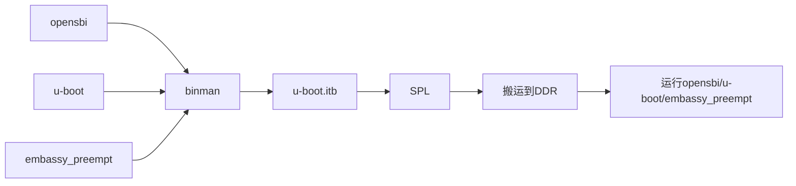
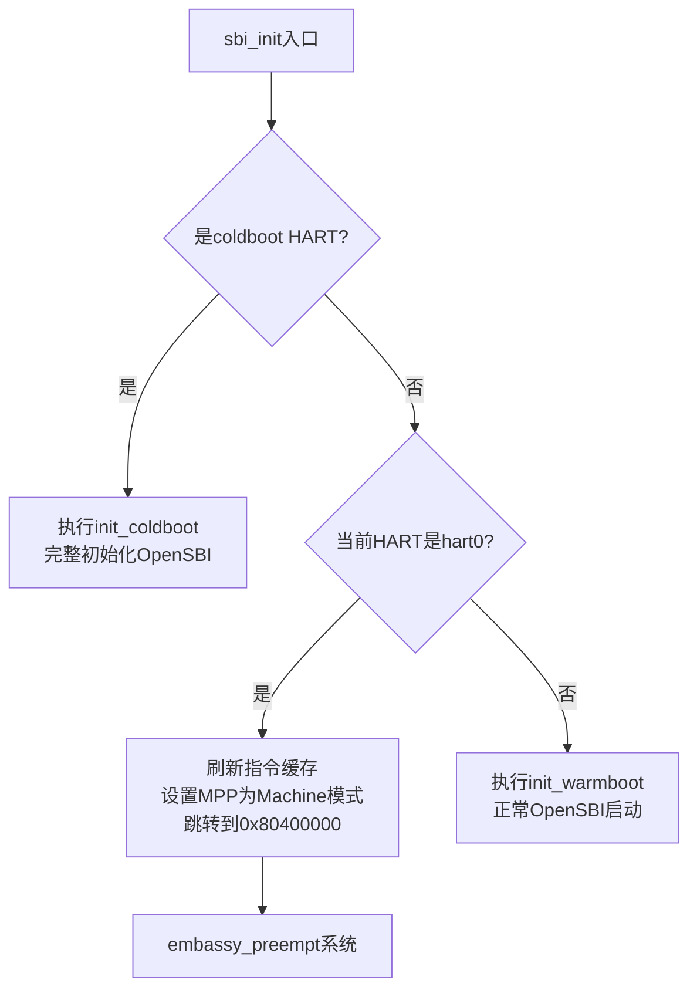

## RISC-V平台支持与VisionFive2移植

## 一、固件构建与启动流程完善

### 1.1 FIT格式固件构建

#### 技术背景
VisionFive2官方使用U-Boot的binman工具生成FIT格式的可烧录固件。SPL负责将FIT镜像搬运到DDR后运行。

#### 构建流程


#### 实现
- 修改U-Boot的设备树(dts)配置，添加embassy_preempt二进制条目
- 使用binman自动处理镜像打包

#### 构建命令
- 构建命令：设置环境变量EMBASSY_PREEMPT为embassy_preempt的bin文件路径后`make uboot`


## 二、启动跳转机制实现

### 2.1 跳转问题诊断与解决

#### 问题排查流程
```
跳转失败
  ↓
替换为简单循环程序测试
  ↓
确认跳转指令问题
  ↓
参考async-summary实现
  ↓
jump_to_payload函数实现
  ↓
跳转成功
```

### 2.2 jump_to_payload函数实现

#### 汇编级跳转实现

```c
static void __attribute__((naked)) jump_to_payload(unsigned long entry,
						    unsigned long hart_id,
						    unsigned long opaque)
{
	__asm__ __volatile__(
		"csrw	mepc, a0\n"	/* Save entry address to mepc */
		"mv	a0, a1\n"	/* a0 = hart_id (first arg for payload) */
		"mv	a1, a2\n"	/* a1 = opaque (second arg for payload) */
		"mret"		/* Jump to payload */
	);
}
```

#### 参数说明
- `entry`: 目标程序入口地址（embassy_preempt: 0x80400000）
- `hart_id`: 硬件线程ID（hart0 = 0）
- `opaque`: 用户自定义参数（可用于传递配置信息）

### 2.3 OpenSBI集成跳转逻辑

#### 跳转时机与流程

跳转发生在OpenSBI的`sbi_init()`函数中，这是所有HART进入OpenSBI后的统一入口点。跳转逻辑如下：



#### 修改位置：`opensbi/lib/sbi/sbi_init.c`

```c
void __noreturn sbi_init(struct sbi_scratch *scratch)
{
    // ... 前置处理 ...

    if (coldboot)
        init_coldboot(scratch, hartid);  // 某个HART完整初始化OpenSBI
    else {
        sbi_printf("Hart %u skipping coldboot\n", hartid);
        if (current_hartid() == 0) {
            /* Flush instruction cache before jumping */
            RISCV_FENCE_I;

            /* Set MPP to Machine mode for next mret */
            csr_write(CSR_MSTATUS,
                 (csr_read(CSR_MSTATUS) & ~MSTATUS_MPP) |
                 (PRV_M << MSTATUS_MPP_SHIFT));

            sbi_printf("Hart 0: Jumping to payload at 0x80400000\n");

            /* Jump to payload with hart_id=0, opaque=0 */
            jump_to_payload(0x80400000, 0, 0);

            /* Should never reach here */
            sbi_hart_hang();
        } else {
            init_warmboot(scratch, hartid);  // 其他HART正常启动
        }
    }
}
```

## 三、UART16550串口驱动实现

### 3.1 硬件特性

#### UART16550规格
- **地址映射**: 0x10000000
- **寄存器宽度**: 8位
- **通信协议**: 8N1（8数据位，无校验，1停止位）

### 3.2 驱动实现

#### 参考来源
[async-summary](https://github.com/liu0fanyi/async-summary) 仓库的UART实现

#### 核心代码结构

```rust
// modules/embassy-preempt-platform/src/riscv64/driver/uart16550.rs

pub struct Uart16550 {
    base: usize,
}

impl Uart16550 {
    pub fn new(base: usize) -> Self {
        // 初始化UART
        // 设置波特率、数据位等参数
    }

    pub fn write_byte(&mut self, byte: u8) {
        // 等待THR为空
        while self.read_reg(OFFSET_LSR) & LSR_THRE == 0 {}
        // 写入数据
        self.write_reg(OFFSET_THR, byte);
    }
}
```

### 3.3 输出验证

#### 跳转成功验证
```
Hart 0: Jumping to payload at 0x80400000
```

#### 串口输出成功

虽然会与opensbi的输出以及后面uboot的输出产生交叉，这是正常的。因为没有做多系统之间的uart的锁


## 四、遗留问题与后续计划

- 在[async-summary](https://github.com/liu0fanyi/async-summary)中也提到没有实际陷入trap，在s7上的中断管理仍然需要调试，可以参考别的操作系统移植
- 如何确保U-Boot之后的操作系统代码不踩踏embassy_preempt使用的内存空间

## 五、技术总结

- 完成FIT格式固件构建流程
- 集成embassy_preempt到U-Boot binman配置
- OpenSBI跳转机制实现
- Hart0成功跳转到embassy_preempt (0x80400000)
- UART16550驱动实现