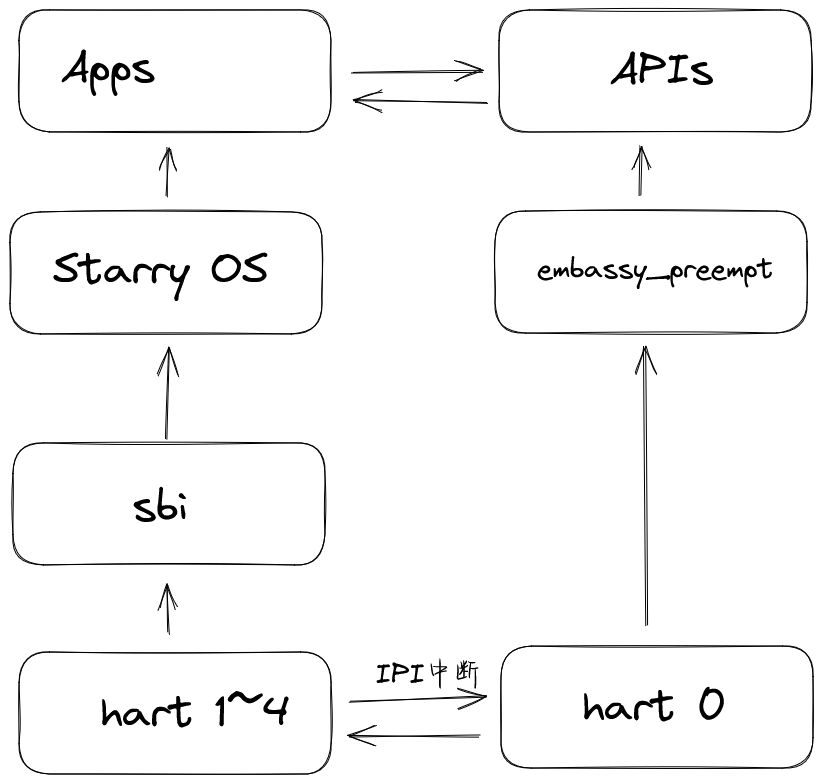

# 项目记录 - 2026年3月24日会议讨论

## 一、当前进展

### 1.1 Hart间通信机制已实现

**架构**：
```
hart0 (M态): embassy_preempt ──┐
hart1 (S态): StarryOS          │
hart2 (S态): StarryOS          ├── IPI通信
hart3 (S态): StarryOS          │
hart4 (S态): StarryOS          ┘
```

**已实现功能**：
- **embassy → StarryOS**：定时发送IPI，StarryOS成功接收
- **StarryOS → embassy**：通过 `echo 1 > /dev/ipi` 触发hart0中断

**实现细节**：
- 大核(hart0)写小核(hart1)的MSIP寄存器触发中断：`0x02000004 = 1`
- 小核通过SBI中转，SBI特判核心0的MSI调用直接触发hart0的S态软件中断
- 性能与原生SBI调用相当

### 1.2 共享内存

- 共享内存地址：`0xc8000000`
- 双向独立信道避免竞争

---

## 二、系统架构

### 2.1 核心架构（异构多核）



### 2.2 调用流程

```
User App (StarryOS)
    │
    │ ecall (系统调用)
    ▼
StarryOS Kernel
    │
    │ IPC (IPI + 共享内存)
    ▼
embassy_preempt (Hart 0)
    │
    │ 执行硬件操作
    ▼
Hardware (GPIO/PWM/中断)
```

### 2.3 设计理念

- **StarryOS**：复杂逻辑处理（文件系统、网络、用户交互）
- **embassy_preempt**：实时硬件控制（GPIO、PWM、中断处理）

---

## 三、下一阶段工作

### 3.1 通信机制

1. **Notification** - 信号通知机制
2. **Message Queue** - 消息队列
3. **RPC/IPC** - 远程过程调用

### 3.2 API封装

- embassy提供的硬件操作API
- 通过StarryOS系统调用暴露给用户应用

### 3.3 性能测试

- 测试三种接口的延迟
- 场景：App → embassy → GPIO操作
- 完成性能测试报告

---
