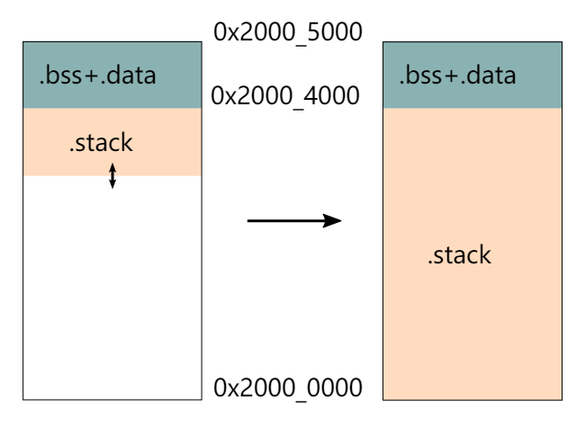

# Rust-uC/OS II开发杂记

# 本篇主要内容

本篇的主要内容为，在开发过程中遇到的一些代码上的问题，包括Rust的语言特性，以及对Embassy和uCOSII更深层次的一点理解和一些变动

# 1. rust cargo error

## 1.1 cargo shows error

rust analyzer runs at the same time you run a `cargo` command after updating the toolchain file. If it's not that please open a new rustup issue

[https://github.com/rust-lang/rust-clippy/issues/12763](https://github.com/rust-lang/rust-clippy/issues/12763)

The workaround is to uninstall the toolchain and reinstall it, usually stopping rust analyzer or similar while you're doing that

## 1.2 cargo stuck in  **waiting for cargo metadata or cargo check**

[https://github.com/rust-lang/rust-analyzer/issues/10910](https://github.com/rust-lang/rust-analyzer/issues/10910)

## 1.3 A Chinese problem, we may need mirror accelerate

[https://juejin.cn/post/7133482060307496997](https://juejin.cn/post/7133482060307496997)

and we set a proxy for git 

[https://blog.csdn.net/yoyo_u/article/details/132637141](https://blog.csdn.net/yoyo_u/article/details/132637141)

# 2. defmt

as the code show below, the defmt and log feature can not be active at the same time.

```jsx
#[cfg(all(feature = "defmt", feature = "log"))]
compile_error!("You may not enable both `defmt` and `log` features.");
```

# 3. Why Embassy-Executor’s test can run with src in no_std?

[https://stackoverflow.com/questions/28185854/how-do-i-test-crates-with-no-std](https://stackoverflow.com/questions/28185854/how-do-i-test-crates-with-no-std)

# 4. rust conditional compilation

## 4.1 how to use `[env]` section of `.cargo/config.toml`

[https://doc.rust-lang.org/cargo/reference/config.html](https://doc.rust-lang.org/cargo/reference/config.html)

## 4.2 the usage of cfg & cfg_attr

[https://doc.rust-lang.org/reference/conditional-compilation.html](https://doc.rust-lang.org/reference/conditional-compilation.html)

# 5.covariant

[https://doc.rust-lang.org/reference/subtyping.html](https://doc.rust-lang.org/reference/subtyping.html)

[https://stackoverflow.com/questions/74990774/how-to-understand-covariance-in-rust](https://stackoverflow.com/questions/74990774/how-to-understand-covariance-in-rust)

[https://doc.rust-lang.org/nomicon/subtyping.html](https://doc.rust-lang.org/nomicon/subtyping.html)


# 6. fnonce vs fnmut vs fn rust

[https://google.github.io/comprehensive-rust/std-traits/closures.html](https://google.github.io/comprehensive-rust/std-traits/closures.html)

# 7. how can we transfer from a function pointer to a closure

# 8. const fn

The const fn can be called at compiling time so there are some restrictions of it(Just like cpp?).

[https://doc.rust-lang.org/reference/const_eval.html](https://doc.rust-lang.org/reference/const_eval.html)

# 9. feature `edition2021` is required

Caused by:
feature `edition2021` is required

consider adding `cargo-features = ["edition2021"]` to the manifest

[https://stackoverflow.com/questions/69848319/unable-to-specify-edition2021-in-order-to-use-unstable-packages-in-rust](https://stackoverflow.com/questions/69848319/unable-to-specify-edition2021-in-order-to-use-unstable-packages-in-rust)

however, my problem is that my toolchain set the rust so old

```rust
[toolchain]
channel = "nightly-2024-06-18"
components = [ "clippy", "llvm-tools-preview", "rust-src", "rustfmt" ]
profile = "minimal"
```

# 10. liveshare give full access

[https://stackoverflow.com/questions/53729195/visual-studio-live-share-as-a-host-how-to-give-access-permission-to-my-particip](https://stackoverflow.com/questions/53729195/visual-studio-live-share-as-a-host-how-to-give-access-permission-to-my-particip)

# 11. can’t use lazy_static with no_std

[https://stackoverflow.com/questions/73049446/could-not-compile-lazy-static](https://stackoverflow.com/questions/73049446/could-not-compile-lazy-static)

[https://github.com/rust-lang-nursery/lazy-static.rs/issues/35](https://github.com/rust-lang-nursery/lazy-static.rs/issues/35)

# 12. the `layout` of rust

[https://doc.rust-lang.org/reference/type-layout.html](https://doc.rust-lang.org/reference/type-layout.html)

[https://doc.rust-lang.org/nightly/core/alloc/struct.Layout.html](https://doc.rust-lang.org/nightly/core/alloc/struct.Layout.html)

# 13. how to design the OSTCBTbl

To make space allocation certain, we can not design the `OSTCBTbl` as uC/OS. In uC/OS the TCBs’ size is confirmed and same. But in our Rust-uC/OS, because we use future, the size of `TaskStorage` is not the same, and we can not confirmed it before we know how the async func is defined.

We can find that the source of the problem is the size of futures of every `TaskStorage` is different, but we want to make it the same to avoid some tough issues related to memory.

<aside>
💡 So I thought about to set the Size of `TaskStorage` as the maximum of all the objects of `TaskStorage` . But because we can not calculate the maximum when we init the TCB Table, so we abandoned the plan.

</aside>

There is another way to solve this problem: using pointer. But unavoidably there will be some raw pointers and unsafe code block. But for now, we will take this approach. In the future, we can wrap the raw pointer by some types to make our code safe.

# 14. the Function of UnsafeCell

Quote from copilot:

> **内部可变性**：允许在外部看似不可变的情况下，修改`UnsafeCell<T>`内部的值。这对于实现像`RefCell<T>`和`Mutex<T>`这样的类型非常重要，这些类型提供了在运行时而不是编译时检查借用规则的能力。
**绕过借用规则**：正常情况下，Rust不允许在存在不可变引用的同时创建可变引用，因为这可能导致数据竞争和不一致的状态。然而，通过使用`UnsafeCell<T>`，开发者可以手动管理这种访问，允许在不违反所有权模型的前提下，进行更灵活的内存访问。
**安全性责任**：使用`UnsafeCell<T>`意味着绕过了Rust编译器的安全检查，将安全性的责任转移到了开发者身上。开发者需要确保使用`UnsafeCell<T>`时不会引入数据竞争或其他安全问题。
**底层构建块**：`UnsafeCell<T>`通常被用作构建更高级别抽象的底层构建块，如同步原语（`Mutex`、`RwLock`等）或其他需要内部可变性的类型。直接使用`UnsafeCell<T>`是不常见的，除非你正在实现这些高级抽象。
> 

So, only when the inner var is immutable, but we need it to be mutable temporary will we wrap the var in `UnsafeCell` . It is common to wrap static var or var with static life-cycles in `UnsafeCell`

# 15. the import of Future

In the definition of TCB, we need to import the future of the task. But for Future is a trait, so we only import it as a trait bound:

```rust
pub(crate) struct OS_TCB<F: Future + 'static>{...}
```

But we want to be uncoupled so that in other crate, only OS_TCB_REF can be visited. So we wrap the TCB as OS_TCB_REF:

```rust
pub struct OS_TCB_REF{
    ptr:NonNull<OS_TCB>,
}
```

But after we import the Future, we need to add a trait bound to OS_TCB_REF too:

```jsx
pub struct OS_TCB_REF<F: Future + 'static>{
    ptr:NonNull<OS_TCB<F>>,
}
```

Besides, everything about the OS_TCB_REF needs to be added a trait bound. As a result, there will be too much var having a static life time, which is not what we want to see.

<aside>
💡 In uC，TCB can have a static life time in order to ensure the certainty of space allocation. But we don’t want to make the REF also having the static life time, because only the running task is meaningful to us.

</aside>

In Embassy, the TCB is separated from the future：

```jsx
pub struct TaskStorage<F: Future + 'static> {
    raw: TaskHeader,
    future: UninitCell<F>, // Valid if STATE_SPAWNED
}
```

`TaskRef` still point to `TaskHeader` , which has nothing to do with Future.:

```rust
#[derive(Clone, Copy)]
pub struct TaskRef {
    ptr: NonNull<TaskHeader>,
}
```

In this way, there is no need to add a trait bound to `TaskRef` . So it can be recycled freely. When we want to get the `TaskStorage` , we can use type casting, for `TaskHeader` is `TaskStorage` ’s first member.

So we will refer to the realization of Embassy. So in OS_init, we should alloc an array of `OS_TASK_STORAGE`, instead of `OS_TCB` .

# 16. the Executor

In the Rust-uC we imagine, there is no concept of thread. So there just need an executor, which I will make it lazy_static.

Besides, there is also no need to add a member to TCB to store the executor, which is different to Embassy. 

# 17. String & str

At the beginning, we can only use str, for it is a slice, which doesn’t require a heap allocator. 

But there is still one problem: the size of str can be confirmed when compiling. So we have to impl a heap allocator. Otherwise, we can only use unsafe code.

After we impl a heap allocator, we can use the String type, which is **Sized** in Rust.

# 18. Global Static Var

In the first version of our uC/OS, we just use `pub` and `static` to define global var. It is so annoyed because it makes our code unsafe. In the second version of Rust-uC, we try to refer to the realization of Embassy and rCore. 

In Embassy, the `RtcDriver` is static and we need to change its member in the static life time. It’s definition looks like:

```rust
embassy_time_driver::time_driver_impl!(static DRIVER: RtcDriver = RtcDriver {
    period: AtomicU32::new(0),
    alarm_count: AtomicU8::new(0),
    alarms: Mutex::const_new(CriticalSectionRawMutex::new(), [ALARM_STATE_NEW; ALARM_COUNT]),
    #[cfg(feature = "low-power")]
    rtc: Mutex::const_new(CriticalSectionRawMutex::new(), Cell::new(None)),
});
```

Here, Embassy use `Mutex` and `AtomicU32` for the static structure’s member to ensure the thread safety. The `Mutex` used here is defined in `embassy::sync` and `AtomicU32` is in the `core::sync::atomic` . Actually, there is also a `Mutex` in `critical-section` . It expose a safe interface to us. Because there is only one core on our board, so we can ensure that if we acquire a critical section, the interrupt will be disable and task will not switch. 

So we will use `AtomicU32` to keep var of primary data type thread safe, and use `critical-section::Mutex<RefCell<T>>` to keep var of other type safe.

Besides, by using `Atomic` , we can change the global var without critical section:

```rust
fn next_period(&self) {
    let r = regs_gp16();

    // We only modify the period from the timer interrupt, so we know this can't race.
    let period = self.period.load(Ordering::Relaxed) + 1;
    self.period.store(period, Ordering::Relaxed);
    let t = (period as u64) << 15;

    critical_section::with(move |cs| {
        r.dier().modify(move |w| {
            for n in 0..ALARM_COUNT {
                let alarm = &self.alarms.borrow(cs)[n];
                let at = alarm.timestamp.get();

                if at < t + 0xc000 {
                    // just enable it. `set_alarm` has already set the correct CCR val.
                    w.set_ccie(n + 1, true);
                }
            }
        })
    })
}
```

The period’s type is `AtomicU32` and it is one of the members of the RtcDriver. But in the example pick out from Embassy above, it can be get and set without a critical section.

Before, our code looks like this:

```rust
// need a cs
critical_section::with(|_cs| unsafe {
    if OS_IS_RUNNING && OSINT_NESTING > 0 {
        OSINT_NESTING -= 1;
    }
    let _os_int_nesting = OSINT_NESTING;
    // info!("in os_int_exit the OSINT_NESTING is {}", OSINT_NESTING);
    if OS_IS_RUNNING && OSINT_NESTING == 0 {
        os_sched_new();
        OS_TCB_HIGH_RDY = OS_TCB_PRIO_TBL[OS_PRIO_HIGH_RDY as usize];
        (*OS_TCB_HIGH_RDY).stride += OS_STRIDE_NUM / (OS_LOWEST_PRIO - (*OS_TCB_HIGH_RDY).os_prio as usize);
        if OS_PRIO_CUR != OS_PRIO_HIGH_RDY {
            // update the stride
            OSIntCtxSw();
        }
    }
});
```

Though we can ensure there will only one thread enter the critical section, there is still a huge unsafe block.

But now our code may looks like:

```rust
static FOO: Mutex<RefCell<i32>> = Mutex::new(RefCell::new(42));

fn main() {
   critical_section::with(|cs| {
       // Instead of calling this
       let _ = FOO.borrow(cs).take();
       // Call this
       let _ = FOO.take(cs);
       // `RefCell::borrow` and `RefCell::borrow_mut` are renamed to
       // `borrow_ref` and `borrow_ref_mut` to avoid name collisions
       let _: &mut i32 = &mut *FOO.borrow_ref_mut(cs);
   })
}
```

Good, there is no unsafe block.

<aside>
💡 we use the type:`Mutex<RefCell<i32>>` to define the static var because `RefCell` is not thread safe.

</aside>

# 19. the Function of RefCell

In the last part, there is a type: `RefCell` . It provide a mechanism for borrowing checks at run time. We need this because if we do static check on our borrowing of the global var, there are many places that get mutable references to global variables, which will make our code can not pass compiling. But in an OS, this situation is unavoidable, so we need `RefCell` to do borrowing checks at run time.

# 20. the Order of Atomic

[https://course.rs/advance/concurrency-with-threads/sync2.html](https://course.rs/advance/concurrency-with-threads/sync2.html)

There is a para we should pass to func `load` and `store` when we need to read or write the Atomic var. The para is order. Its type is `Ordering` , which is an enum.

As the comment on `Ordering` in Rust lib, `Ordering` is used to:

> Memory orderings specify the way atomic operations synchronize memory.
> 

There are five possible values of `Ordering` :

- Relaxed
  
    > No ordering constraints, only atomic operations.
    [https://en.cppreference.com/w/cpp/atomic/memory_order#Relaxed_ordering](https://en.cppreference.com/w/cpp/atomic/memory_order#Relaxed_ordering)
    > 
- Release
  
    > When coupled with a **store**, all previous operations become ordered before any load of this value with [`Acquire`] (or stronger) ordering.In particular, all previous writes become visible to all threads that perform an [`Acquire`] (or stronger) load of this value.
    This ordering is only applicable for operations that can perform a store
    [https://en.cppreference.com/w/cpp/atomic/memory_order#Release-Acquire_ordering](https://en.cppreference.com/w/cpp/atomic/memory_order#Release-Acquire_ordering)
    > 
- Acquire
  
    > When coupled with a load, if the loaded value was written by a store operation with [`Release`] (or stronger) ordering, then all subsequent operations become ordered after that store. In particular, all subsequent loads will see data written before the store.
    [https://en.cppreference.com/w/cpp/atomic/memory_order#Release-Acquire_ordering](https://en.cppreference.com/w/cpp/atomic/memory_order#Release-Acquire_ordering)
    > 
- AcqRel
  
    > Has the effects of both [`Acquire`] and [`Release`] together:
    For loads it uses [`Acquire`] ordering. For stores it uses the [`Release`] ordering.
    [https://en.cppreference.com/w/cpp/atomic/memory_order#Release-Acquire_ordering](https://en.cppreference.com/w/cpp/atomic/memory_order#Release-Acquire_ordering)
    > 
- SeqCst
  
    > Like [`Acquire`]/[`Release`]/[`AcqRel`] (for load, store, and load-with-store operations, respectively) with the additional guarantee that all threads see all sequentially consistent operations in the same order.
    [https://en.cppreference.com/w/cpp/atomic/memory_order#Sequentially-consistent_ordering](https://en.cppreference.com/w/cpp/atomic/memory_order#Sequentially-consistent_ordering)
    > 

In the comment of the possible values, we can know that we can build a Memory Barrier by using `Release` coupled with `store` and  `Acquire` coupled with `load` (or just use `AcqRel`). In this way, we can ensure the **synchronization** when we read or write an Atomic var, just like we set a mutex.

  

<aside>
💡 By `Release` , the operations before `store` will be finished before the `store` operation, which can ensure that the `store` op is effective and the stored value is visible to other threads. By `Acquire` , the operations after `load` will not be finished before the `load` operation, which can ensure that the `load` op can load the val we need.

</aside>

There is an example:

```rust
use std::thread::{self, JoinHandle};
use std::sync::atomic::{Ordering, AtomicBool};

static mut DATA: u64 = 0;
static READY: AtomicBool = AtomicBool::new(false);

fn reset() {
    unsafe {
        DATA = 0;
    }
    READY.store(false, Ordering::Relaxed);
}

fn producer() -> JoinHandle<()> {
    thread::spawn(move || {
        unsafe {
            DATA = 100;                                 // A
        }
        READY.store(true, Ordering::Release);           // B: Memory Barrier ↑
    })
}

fn consumer() -> JoinHandle<()> {
    thread::spawn(move || {
        while !READY.load(Ordering::Acquire) {}         // C: Memory Barrier ↓

        assert_eq!(100, unsafe { DATA });               // D
    })
}

fn main() {
    loop {
        reset();

        let t_producer = producer();
        let t_consumer = consumer();

        t_producer.join().unwrap();
        t_consumer.join().unwrap();
    }
}
```

# 21. steps to adapt to embassy

[embassy 改变设计想法](https://www.notion.so/embassy-9ae45929a3dc49128a4349679d38fa07?pvs=21)

# 22. Design of the testing part


[https://os.phil-opp.com/testing/](https://os.phil-opp.com/testing/)

[https://ferrous-systems.com/blog/tags/embedded-rust-testing/](https://ferrous-systems.com/blog/tags/embedded-rust-testing/)

## 22.1 I choose the defmt-test:

[defmt/firmware/defmt-test at 704bee6ebfa153aad9dba1fcee5ba0ec6b77f3a8 · knurling-rs/defmt](https://github.com/knurling-rs/defmt/tree/704bee6ebfa153aad9dba1fcee5ba0ec6b77f3a8/firmware/defmt-test)

## 22.2 And learn from the template to know how to use it:

[https://github.com/knurling-rs/app-template](https://github.com/knurling-rs/app-template)

# 23. what does **`flip-link` do ?**

[https://github.com/knurling-rs/flip-link](https://github.com/knurling-rs/flip-link)




# 24. We Need TaskPoolRef

Just as the comments in Embassy：

> type-erased `&'static mut TaskPool<F, N>`. Needed because statics can't have generics.
> 

Because the TaskPool is static in both our uC and Embassy, so it is important to use `TaskPoolRef` to define a `TaskPool`in a static life time

<aside>
💡 the `Arena` is also known as `OSTCBTbl` in uC/OS

</aside>

plus: I add note of static usage:[https://doc.rust-lang.org/reference/items/static-items.html](https://doc.rust-lang.org/reference/items/static-items.html)

and the embassy use this to init TaskPool static var once in the task macro design:

from file embassy-executor-macros/src/macros:113

```rust
    #[cfg(not(feature = "nightly"))]
    let mut task_outer: ItemFn = parse_quote! {
        #visibility fn #task_ident(#fargs) -> ::embassy_executor::SpawnToken<impl Sized> {
            const POOL_SIZE: usize = #pool_size;
            static POOL: ::embassy_executor::_export::TaskPoolRef = ::embassy_executor::_export::TaskPoolRef::new();
            unsafe { POOL.get::<_, POOL_SIZE>()._spawn_async_fn(move || #task_inner_ident(#(#full_args,)*)) }
        }
    };
```

# 25. About Arena

In the last part, we know that we need `TaskPoolRef` because statics can't have generics. But a new problem arose: The `TaskPoolRef` is static but `TaskPool` is not. This will cause error because a ref’s life time is longer than the data it points. So we should do something to make `TaskPool` static too.

In Embassy, `TaskPool` become static with the help of `Arena` . It defined as:

```jsx
    struct Arena<const N: usize> {
        buf: UnsafeCell<MaybeUninit<[u8; N]>>,
        ptr: Mutex<Cell<*mut u8>>,
    }
```

For now, we just focus on `buf` . It is a `UnsafeCell<MaybeUninit<[u8; N]>>` . About `MaybeUninit` , we will discuss it below. Now we just need to know that `MaybeUninit` ’s memory layout is the same to `[u8; N]` . So if we claim an `Arena` with static life time, its member will be static too. We get what we want.

<aside>
💡 “N” is defined as the number of bytes of the TaskPool.

</aside>

Maybe you will ask that if we use `Arena` , why do we still need the `TaskPool` and `TaskPoolRef` ? As shown above and in Embassy, the `Arena` just used to alloc a piece of memory but `TaskPool` or `TaskPoolRef` is used to complete the relevant parts of the task and scheduling. By this, the coupling degree is reduced. Of course we can define `Arena` as:

```jsx
   struct Arena<const N: usize> {
        buf: UnsafeCell<MaybeUninit<[TaskStorage; N]>>,
        ptr: Mutex<Cell<*mut u8>>,
    }
```

In this way, the the coupling degree increases, and there is anther problem: if we use `TaskStorage` directly, we need genericity, which can’t be added to the static `Arena` .

# 26. Sync and Send trait

[Send and Sync - The Rustonomicon](https://doc.rust-lang.org/nomicon/send-and-sync.html)

- A type is Send if it is safe to send it to another thread.
- A type is Sync if it is safe to share between threads (T is Sync if and only if `&T` is Send).

# 27. MaybeUninit

This type is used to define vars which are not init. Its memory layout is the same to the genericity var’s memory layout. MaybeUninit is defined as:

```jsx
  pub union MaybeUninit<T> {
      uninit: (),
      value: ManuallyDrop<T>,
  }
```

For more information about MaybeUninit, read: [https://learnku.com/articles/65520](https://learnku.com/articles/65520)

# 28. Deref and DerefMut

The usage of these trait is:

```rust
 use std::ops::{Deref, DerefMut};

 struct DerefMutExample<T> {
     value: T
 }

 impl<T> Deref for DerefMutExample<T> {
     type Target = T;

     fn deref(&self) -> &Self::Target {
         &self.value
     }
 }

 impl<T> DerefMut for DerefMutExample<T> {
     fn deref_mut(&mut self) -> &mut Self::Target {
         &mut self.value
     }
 }
```

Maybe you will be confused with the `Target` in `DerefMut` . Once you know how `DerefMut` defined, you won't be confused:

```rust
pub trait DerefMut: Deref {
    /// Mutably dereferences the value.
    #[stable(feature = "rust1", since = "1.0.0")]
    #[rustc_diagnostic_item = "deref_mut_method"]
    fn deref_mut(&mut self) -> &mut Self::Target;
}
```

# 29. 关于refmut

[https://doc.rust-lang.org/std/cell/struct.RefMut.html](https://doc.rust-lang.org/std/cell/struct.RefMut.html)

### **`RefCell`**

`RefCell` is a type that provides interior mutability. It allows you to borrow its contents either mutably or immutably, but these borrows are checked at runtime. If you try to violate Rust's borrowing rules (e.g., having multiple mutable borrows or a mutable borrow while there are immutable borrows), the program will panic.

### **`RefMut`**

`RefMut` is a smart pointer type that `RefCell` returns when you borrow its contents mutably. It implements `Deref` and `DerefMut`, so you can use it like a regular mutable reference.

# 30. TokenStream

[https://zjp-cn.github.io/rust-note/proc/proc_macro2.html](https://zjp-cn.github.io/rust-note/proc/proc_macro2.html)

# 31. quote!

[https://zjp-cn.github.io/rust-note/proc/quote.html#quote-与-totokens](https://zjp-cn.github.io/rust-note/proc/quote.html#quote-%E4%B8%8E-totokens)

# 32. 过程宏

[https://zjp-cn.github.io/rust-note/proc/ref.html](https://zjp-cn.github.io/rust-note/proc/ref.html)

学习过程宏的lab（感觉可以考虑开学出成题目）：

[https://github.com/dtolnay/proc-macro-workshop](https://github.com/dtolnay/proc-macro-workshop)

感觉还不错的中文博客：

[Rust过程宏系列教程 | Proc Macro Workshop 之 Builder 实现 - Rust精选](https://rustmagazine.github.io/rust_magazine_2021/chapter_5/proc_macro_workshop_guide_for_builder_project.html)

我自己的lab笔记：

[proc-macro-workshop 笔记 | LiamY’s Blog](https://liamy.clovy.top/en/article/notes/proc-macro-workshop)

很有用的宏debug工具，把宏展开的样子写出来：

[https://github.com/dtolnay/cargo-expand](https://github.com/dtolnay/cargo-expand)

# 33. OUT_DIR环境变量

[https://rustwiki.org/zh-CN/cargo/reference/environment-variables.html](https://rustwiki.org/zh-CN/cargo/reference/environment-variables.html)