# 开发记录

# 本篇主要内容

本篇的主要内容为：按照老师提供的实现路线进行开发时的设计、实现以及所遇到的问题

# 一、二阶段开发记录

## 关于入队列的变动

embassy里面是直接采用头插法将新的task_ref插入，从而更新run-queue链表，而仔细想想，我们的抢占式设计是不需要一个run-queue链表的，我们通过arena分配给taskstorage相应的空间过后，只需要保存它的指针到以数组里面即可（这个数组就相当于ucosii的OSTCBPRIO数组）

> 之所以没有了一个freelist和tcblist维护分配信息，是因为分配的过程是由arena进行动态分配的，因为任务的大小不一样，但是很致命的一点是arena没办法对分配的任务（taskstorage）进行回收，尽管在嵌入式的情况来看，的确不需要，因为每个任务应该都是一个死循环，永远不会退出，所以也就不存在回收的问题。
> 

如果是这样的话，我们目前可以去掉下面这两个TCB的成员，因为不需要维护一个tcb的链表

```rust
 OSTCBNext: SyncUnsafeCell<Option<OS_TCB_REF>>, /* Pointer to next     TCB in the TCB list                 */
 OSTCBPrev: SyncUnsafeCell<Option<OS_TCB_REF>>, /* Pointer to previous TCB in the TCB list                 */
```

所以我们只需要一个以优先级为下标索引到OS_TCB_REF的数组，这个数组可以就放到全局的executor里面，同时还有位图的部分也应该放进去，主要是OSRdyGrp和OSRdyTbl

## Poll to UNready

在执行器里面采取这样的机制：

原来的embassy是poll的时候将整个队列里面的元素都按顺序poll一遍，并且从就绪队列里面删除。现在的思路是：

1. 首先没有抢占的情况：所有的任务都会poll一次，然后poll到await点的地方，就会返回，然后由executor将该任务重新设置为非就绪状态（i.e. 更新位图），然后根据位图找到下一个最高优先级任务去执行
2. 再考虑加上抢占的情况：任务如果是在poll过程中被打断，executor不会更新它的位图，仍然该任务处于就绪状态，保存上下文后，切换到更高优先级任务执行。而如果在poll执行完，由执行器正在处理更新位图，以及查找下一个最高优先级的调度过程的时候，我们打算将这个地方设置为临界区，这样保证这里不会发生中断，中断只能发生在查找到并且转入下一个最高优先级任务之后的时候。

## 执行流程

原来的embassy的方式是：一次执行器的poll执行当前runqueue的所有任务，中途有就绪的任务会加入到“新”的runqueue（其实是原来的runqueue，只是runqueue在执行第一个任务时就会被清空），然后被poll的任务如果await了，就会自然的走到下一个任务执行。

而我们这里取消掉一次性poll完任务，而是一次poll一个任务，完成之后，将该任务设置为非就绪态，然后转到最高优先级任务执行，这里很重要的一点就是这里对于临界区的设置：

对于位图的所有操作都需要加在临界区里面完成：

我们的临界区应该这里需要包含：设置当前任务在位图中为非就绪， 查找位图找到最高优先级，并且设置OSCURPRIO为这个优先级

因为只需要保证在对于位图这个关键变量的读取修改过程是原子的即可

> 这个设计比较巧妙，特别是我们需要将位图的修改（原任务）和读取（查找最高优先级新任务）放置在同一个临界区，我们拿几个假想情况来说明：
~~1（反面例子）. 在查找位图之前，我们设置完当前任务在位图中为非就绪之后，如果能够发生抢占，有更高优先级任务就绪被调度，那么保存现场时，这个现场应该属于哪一个任务呢？当前任务刚刚被设置为非就绪，如果保存到这个任务上，那这个任务就不可能再被唤醒了（因为它并没有等待任何事件，并且被设置为了非就绪态），而新的任务还没有找到，所以我们的上下文就没有位置保存~~
2（正面例子）. 在查找位图选择到最高优先级任务，并且设置当前任务为此任务后，如果还没有poll就遇到了中断抢占，如果此抢占中就绪的任务优先级不如我们这里调度的这个任务，那么这部分调度就直接不会进行，然后交换控制权，回到这个任务，从而继续执行。而如果优先级更高，就是任务切换的环节，那么就会查看这个当前任务是否拥有栈，如果没有栈，就需要将当前的协程栈（公共栈）分配给它，而反之，如果该任务有栈，那么就只需要把上下文放到这个栈里面，并且更新任务tcb中保存的堆栈ref即可（这部分在我们设计文档[https://github.com/KMSorSMS/embassy_preempt/blob/main/docs/设计文档.md](https://github.com/KMSorSMS/embassy_preempt/blob/main/docs/%E8%AE%BE%E8%AE%A1%E6%96%87%E6%A1%A3.md)里面有写，这里也会简要涉及一下）。切换到新任务执行的时候，如果新任务是没有栈的一个协程，那么由于前面的协程公共栈被抢了，所以需要分配一个新的公共栈给协程，并且通过poll来恢复执行程序，而如果新的任务有栈（算是线程），那么就只需要恢复线程就能恢复执行。
> 

这个关键的临界区过程的代码如下：

```rust
             self.set_task_unready(task);
                // after set the task as unready, we need to revoke its stack if it has.
                if task.OSTCBStkPtr.is_some() {
                    dealloc_stack(task.OSTCBStkPtr.as_ref().unwrap());
                }
                // set the task's stack to None
                task.OSTCBStkPtr = None;
                self.find_highrdy_set_cur()
```

注意这里我们还包含了栈的回收，说明一下它也是有必要在这里和位图的更新查找放在一起在同一个临界区进行的：

假设我们把这个过程提前，放在更新位图之前，如果它不在临界区，那么栈的回收过程如果被打断，那么可能会出现当前刚刚回收完成（因为回收过程是原子的，通过lock实现），任务的栈指针还在，所以抢占情况下，会将上下文保存在这个栈里面，但是这个栈已经被回收了，会出现未定义的行为。

那如果把这个过程单独放到一个临界区，那么也会有错误，因为在回收过后，如果任务还没被设置为非就绪态的时候，如果被抢占，那么会将当前程序的栈分配给该任务，然后又调用栈分配器分配一个新的栈给程序，这种情况下，恢复执行后，该任务的栈并不会被回收，因为上一步已经回收过了，然后该任务同样保留着栈，尽管它是经过主动让权来的，并且只是在主动让权的执行器处理中被抢占，但是这种处理就会使得这个任务让权后仍然是一个线程而不是协程。（当然，这样让我想到如果把执行器这部分过程也看做一个任务的话，好像就是可以接受的，不过我们暂且先按照原来的思路实现，后续改进可以考虑）

### 续写：临界区的讨论

发现前面对于临界区的想法不是很全面，实际上就正确性而言的确只需要保证对全局变量的原子性即可，后续我们还会调整原来的这个设计。

### 补充：这个部分涉及栈回收

在poll完一个任务之后（这个时候就是由于await主动让权走到执行器这里），如果任务是占有栈的，那么就把这个栈给回收了，如果没有占有栈，那就不需要做出什么变动。

我们先只考虑主动让权的情况：

那么肯定当前任务只要拥有栈，那就将这个栈回收（注意这里的任务没有现场保护，因为是主动让权，一定是await或者任务结束），然后我们选择最高优先级任务进行调度，如果这个任务有栈，那么就应该按照线程的恢复方式恢复现场，如果没有栈才会调用poll。

### 补充：同时这里恢复现场需要内联汇编

[内联汇编 - Rust语言圣经(Rust Course)](https://course.rs/advance/unsafe/inline-asm.html)

## WFE指令与时钟

WFE指令的功能如下：


从上表中可以发现当我们使用了WFE指令之后将进入Sleep mode。

而几乎所有的处理器，进入低功耗模式或睡眠模式之后都会有部分CPU/MCU功能以及部分外设无法使用以实现降低能耗。而我们需要保证在使用了WFE指令之后，我们的delay还能正常工作，就必须保证我们使用的定时器不会在进入低功耗模式的时候被关闭。

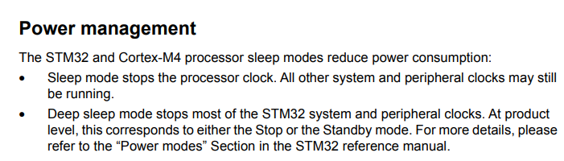

从上图中可以发现当我们使用了WFE指令之后，除了处理器时钟（AHB总线）被停止，其他所有的时钟都将正常工作。这意味着挂载在APB上的外设时钟Timer都可以正常工作。

唯一一个需要注意的点是：


手册中提到，SysTick是基于处理器时钟的，因此当我们使用了WFE指令之后，将会导致SysTick无法正常工作。这应该也是Embassy中选择使用外设时钟进行delay设计的原因之一。**同样的，在我们的系统中，由于我们在无任务调度的时候使用了WFE指令，因此我们不能使用Systick来实现操作系统的时间触发机制，我们只能按照Embassy的做法，占用一个外设时钟来作为delay的驱动时钟。**

## 关于Memory.x的设置问题

[https://github.com/rust-embedded/cortex-m-quickstart/blob/master/README.md](https://github.com/rust-embedded/cortex-m-quickstart/blob/master/README.md)

## 过大函数调用栈开销


claim这里，这个critical-section，在进入这个临界区之前，sp是170，进入之后170的栈直接没了，直接消耗完了

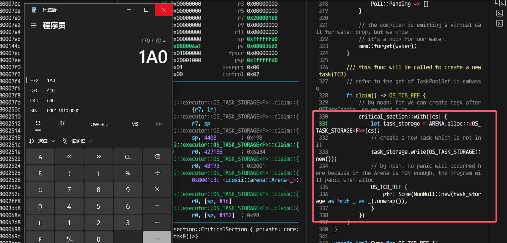

这个闭包的栈这么大，416Byte

这就得仔细看看反汇编它为啥吃了这么多栈（sub sp, #408 进一步确认了里面函数栈用掉了408字节（416B是加上r7和sp的压栈））：


进入到arena的alloc后，用的栈也不少，我开始觉得是不是这里编译器没有优化（因为我为了调试方便设置的不优化）


### 于是我就试试开优化

又出问题了，开了优化之前换栈之后的跳转返回出问题了


发现原因，优化过后这里做成内联了：


于是我想到：是不是可以利用这个，我想办法让这个外部函数做出内联，这样以后都直接不需要函数跳转返回了

# 第三阶段开发记录

## **第三阶段**

在uCOS中**有中断的场景**下，引入embassy和优先级，以支持线程和协程的优先级调度；

- 中断就是抢占情况，需要保存堆栈，并（有可能）分配新堆栈，用于恢复下一个任务；

## **第三阶段设计**

在开始第三阶段的coding之前，需要考虑以下的几个问题

### **明确任务边界**

即需要明确哪一部分代码属于任务执行的代码。由于编译器为我们完成了非叶子future状态机的状态转换过程，因此导致在判定代码是否属于任务时会显得比较模糊。但是经过我们的分析之后，认为只有当从任务中返回到执行器代码时，才代表着该任务结束，即将状态转移等编译器生成的代码的执行也认为是任务的执行。如果这样划分的话，那么在中断时是否需要分配栈就变得容易区分了：如果当前在执行的是执行器代码，那么此时在中断中不需要分配栈(因为上一个任务已经主动让权了)；如果当前执行的不是执行器代码，那么此时如果发生了抢占，就需要在中断中就需要分配栈，因为当前的任务的执行流被打断了，并且即将被抢占。

### **如何让中断程序知道当前在执行哪部分代码？**

对中断服务程序而言，如果不做任何的干预，它是无法知道当前在执行的究竟是执行器代码还是任务代码的。我们目前的设想是，将执行器代码放入临界区中，让其不可被打断，那么这样就会使得所有的中断都将在执行任务代码时产生，这样所有将导致抢占的中断都可以无脑分配一个栈给当前任务，使得处理得以简化。 

目前有两种比较类型的实现方式：

- 为执行器增加一个状态成员，以标记当前执行器是否在执行任务代码
- 设定一个全局变量：进入执行器代码时以及退出执行器代码时都对一个全局变量进行设置，在进行栈分配时对全局变量进行检查

### **中断服务程序如何设计？**

在中断服务程序中，我们还应该在中断返回时增加几个功能：

- 栈分配模块(仅在发生抢占时执行，即新任务的优先级更高)：用于分配一个新栈以供系统继续运行。而旧栈将用于保存原有任务的执行现场
- 唤醒模块：将新任务设置为就绪状态
- 抢占调度模块：用于在中断返回时进行重调度 我们将把前两个模块作为唤醒器Waker的功能。而对于抢占重调度，我们将重新编写一个调度函数接口。

### 抢占调度

首先先回顾一下目前我们的poll函数的执行流程：

- 启动：找到当前优先级最高的任务，然后执行该任务。

<aside>
💡 此时，我们会判断当前任务是否拥有一个栈，即判断任务是由线程执行还是由协程执行

</aside>

- 栈回收：在该任务让权之后，将会判断该任务是否拥有一个栈，如果拥有一个栈的话，将回收该栈
- 继续调度：完成栈回收之后，将重新寻找最高优先级的任务，并执行该任务。接下来将循环2、3步直至所有的任务都主动让权。

目前我们的设想是通过修改poll函数，使其能够在完成现阶段的功能下（即支持让权调度）支持抢占调度。

我们目前设想的方案为：若新任务没有栈（即代表新任务未被抢占过），旧任务没有栈，则此时需要分配一个新栈以供所有的任务执行，而旧栈将作为旧任务的私有栈用于保存上下文以及调用关系；若新任务有栈，旧任务没有栈，则此时不需要再额外分配一个栈，而是直接将新任务的上下文从栈中恢复之后，再将新栈作为所有任务的公共栈，而非新任务的私有栈，直至通过poll函数找到了一个拥有栈的任务之后，再将当前的公用栈回收再从。而旧栈同样将做为旧任务的私有栈使用。

此外，我们将对栈的操作分为三类：

- 栈回收：即将栈“销毁”，对应的可能是栈清空等操作
- 栈复用：即将某一个任务的私有栈作为所有任务共用的栈，只是将任务TCB中的栈指针置为None
- 栈分配：即通过栈分配器分配一个栈用以接下来的任务共用

因此，上述文字转换为表格即为：

| 切换方式 | 新任务 | 旧任务 | 操作 |
| --- | --- | --- | --- |
| 抢占 | 无栈 | 无栈 | 不存在 |
| 抢占 | 无栈 | 有栈 | 无需操作 |
| 抢占 | 有栈 | 无栈 | 不存在 |
| 抢占 | 有栈 | 有栈 | 不存在？ |
| 让权 | 无栈 | 无栈 | 无需操作 |
| 让权 | 无栈 | 有栈 | 不存在 |
| 让权 | 有栈 | 无栈 | 栈回收 |
| 让权 | 有栈 | 有栈 | 不存在 |

<aside>
💡 不可能出现的情况在上表中记为“不存在”，不需要做做任何操作，仅需要进行正常任务调度的情况记为“无需操作”。在这里已经不会出现栈分配的情况是由于所有抢占调度的栈分配都将在栈分配阶段完成，因此在调度阶段旧任务无栈的情况是不存在的；这里没有栈复用的情况是由于，我们目前认为，中断服务程序只会唤醒通过await让权之后退出就绪队列的任务，即新任务无栈，因此栈复用的情况也不存在了

</aside>

从上表的讨论可以发现，如果在wake阶段以及栈分配阶段进行栈分配并且将任务置入就绪队列的话，那么或许就可以直接复用现有的poll方法。

## 关于抢占的讨论与看法

在前面做1、2阶段的实现的时候，我在写执行器的poll函数的时候想了比较多的地方，最开始认为集中的把：设置当前任务为unready、回收栈、查找最高优先级任务调度整个过程都设计在一个临界区里面保证线性连续执行是高效并且有必要的。但是在后续开发思考的时候，至少对于必要性有了质疑，这里我先论证一下是否必要：

```rust
self.set_task_unready(task);
// after set the task as unready, we need to revoke its stack if it has.
if task.OSTCBStkPtr.is_some() {
    dealloc_stack(task.OSTCBStkPtr.as_mut().unwrap());
}
// set the task's stack to None
task.OSTCBStkPtr = None;
self.find_highrdy_set_cur()
```

我认为只需要对executor（因为设计为全局变量）的关键成员变量（也就是位图，OSPrioCur）分别设置临界区就行了，同样正确性是不会有问题的。

为了证明这一点，只能（我能想到的方法）列举出（几乎）所有情况来说明：

我们poll的操作如下：

```rust
pub(crate) unsafe fn poll(&'static self) {
        // find the highest priority task in the ready queue
        let task = critical_section::with(|_| self.find_highrdy_set_cur());
        if task.is_none() {
            return;
        }
        let mut task = task.unwrap();
        if task.OSTCBStat.run_dequeue() {
            if task.OSTCBStkPtr.is_none() {
                task.OS_POLL_FN.get().unwrap_unchecked()(task);
            } else {
                // if the task has stack, it's a thread, we need to resume it not poll it
                task.restore_context_from_stk();
            }
        }
        // after the task is done, we need to set the task to unready(in bitmap) and also we need to find the next task to run
        // both of this process should be done in critical section
        loop {
            match critical_section::with(|_| {
                self.set_task_unready(task);
                // after set the task as unready, we need to revoke its stack if it has.
                if task.OSTCBStkPtr.is_some() {
                    dealloc_stack(task.OSTCBStkPtr.as_mut().unwrap());
                }
                // set the task's stack to None
                task.OSTCBStkPtr = None;
                self.find_highrdy_set_cur()
            }) {
                Some(t) => {
                    task = t;
                    if task.OSTCBStat.run_dequeue() {
                        // in the future, we should consider thread here
                        task.OS_POLL_FN.get().unwrap_unchecked()(task);
                    }
                }
                None => {
                    break;
                }
            }
        }
    }
```

poll里面会进行任务的让权切换，poll的调用总是由于当前没有任务执行后才调用的，也就是所有任务都await了，这里我就想到有个地方会出问题：如果最后一个任务被poll调度执行了，然后它await出来，然后executor发现目前没有任务可以调度，那么跑到None准备break，如果这个时候中断来了，wake了某个任务，从而让该任务变为就绪，这个时候当然就在interrupt里面可以执行任务抢占调度，转向高优先级任务执行（也就是刚就绪的那个任务），~~这一步跳转的实现我在想应该可以复用执行器的poll，这样如果这个任务执行await让权，又能重新继续。~~ ~~这会经历将当前的程序栈分配给当前任务，将当前任务设置为~~  这个时候是没有任务被选择执行的状态，那么是不是就没有保证当前上下文的必要，直接跳转到新的任务执行即可，并且这个时候是能直接复用poll的，只需要我们把外部的wfe的执行放置到idle任务去执行：

```rust
    loop {
        unsafe {
            GlobalSyncExecutor.as_ref().unwrap().poll();
            info!("==========enter Task Idle...===========");
            run_idle();
            info!("==============wake up!==============");
        }
    }
```

也就是在这里，把run_idle()更改到idle任务（prio为OS_LOWEST_PRIO）去执行

TODO：临界区分开设置的可行性讨论：

### ok，顺着这个思路我们重新想想中断的处理

如果中断都变成只是任务设置为就绪，那实时性无法保证，而且也做不到抢占调度。我的设想是执行器的poll就做成**一个循环：**找到最高优先级，调度最高优先级任务执行，然后将任务设置为非就绪，然后重复。中途发生抢占只会出现在执行任务的过程中（注意，这个是包括了： 

```rust
   if task.OSTCBStkPtr.is_none() {
                task.OS_POLL_FN.get().unwrap_unchecked()(task);
            } else {
                // if the task has stack, it's a thread, we need to resume it not poll it
                task.restore_context_from_stk();
            }
```

这整个过程）

这个时候如果中断抢占调度，那么将当前的栈（程序栈）分配给执行任务，保存它的上下文到这个栈，然后恢复新的任务，如果该任务有栈，那么把它的栈给到程序栈（设置PROGRAM_STACK变量，并且更改PSP设置程序栈），然后去掉该任务的栈（设置它的stk为NONE），然后恢复它的上下文执行，但是这里，这样这个任务执行的时候就是一个无栈的协程，用的是程序栈。~~等这个程序执行完成后，会先返回到原来中断处理函数的结尾（但是此时是函数返回进入，在调度执行前，应该要设置取消掉中断状态），然后继续返回回执行器的poll部分~~。

感觉还可以把这个过程细化的说一下（将几个关键过程放在同一个临界区的模式，后续这种模式可能会改变为拆分成多个临界区）：

1. 中断抢占发生, 一部分现场立刻被保存到当前程序栈(psp)上（xPSR, PC, LR, R12, R0-R3），同时栈会切换到msp异常堆栈
2. 中断处理函数里面，由于某个future好了，设置对应的任务为就绪，执行执行器的中断poll函数（目前还没写这个函数），并且在cortex-m的情况下，我们想要退出中断处理模式需要参考手册：


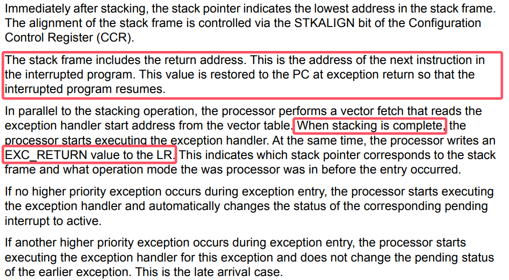

1. 在执行器的中断poll函数（目前还没写这个函数，这个函数参考ucosii port里面的pendsv的实现）中， 会找到最高优先级任务，然后将程序栈分配给被打断的程序（可以判断是否当前任务就是最高优先级的，是的话就不分配栈，直接异常/中断返回即可）。这样当前任务的上下文就保存了。然后转向最高优先级任务的处理。
2. 如果最高优先级任务是没有栈的，这里就和ucosii不一样，首先我们要给它**分配一个栈空间**用于程序执行，然后这里需要模拟压栈（先是xPSR, PC, LR, R12, R0-R3，其中xpsr赋值为0x01000000，PC赋值为执行器poll的地址，LR为一个TASK_RETURN函数地址，R12，R0-R3的值任意，然后是R4-R11赋值为任意, LR赋值为0xFFFFFFFD），这样后续的过程和第5步一样，相当于任务的栈就是目前的psp
3. ~~如果最高优先级任务是有栈的，和ucosii基本一样，将任务的栈先出栈R4-R11, R14（这些是任务保存的不是进入异常保存的寄存器），然后将psp设置为当前的任务栈（出栈后的）（这里同步修改全局变量PROGRAM_STACK，之前它的值的所有权会转移给原任务的OSTCBStkPtr字段，用于上下文保存），然后执行BX LR（也就是R14，通常这里面会装入0xFFFFFFFD），进行异常返回，从而切换到新的任务执行。~~
   
    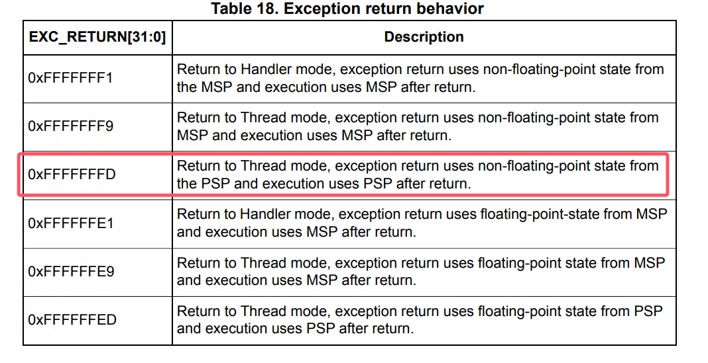
    

执行器的poll的body也有变动：

对于执行到有栈的任务的时候，就需要进行栈回收，因为切换到该任务执行后就是把整个psp函数栈都切换走了，实际上当前的这个psp栈就不需要了，所以将变量PROGRAM_STACK的值更新为新的栈，将原来的栈dealloc掉。这里也就是我们这个栈回收的地方，前面上文的抢占过程就是栈分配产生的地方。

至此整个流程设计完成，还剩下关于临界区的分割的问题，我觉得可以写完了代码之后再做细化。

### 一点更正

会更模仿ucosii的处理，借助pendsv中断实现抢占的时候的任务切换。

中断poll函数：

```rust
/// this function must be called in the interrupt context, and it will trigger pendsv to switch the task
    /// when this function return, the caller interrupt will also return and the pendsv will run.
    pub(crate) unsafe fn interrupt_poll(&'static self) {
        extern "Rust" {
            fn OSTaskStkInit(stk_ref: NonNull<OS_STK>) -> NonNull<OS_STK>;
            fn restore_thread_task();
        }
        // find the highest priority task in the ready queue
        critical_section::with(|_| self.set_highrdy());
        // judge if the highest priority task is the current running task(which has been preemped by the interrupt)
        // prio's number is small indicates the priority is high
        if self.OSPrioHighRdy.get() >= self.OSPrioCur.get() {
            return;
        }
        let mut task  = self.OSTCBHighRdy.get();
        // then we need to restore the highest priority task
        if task.OSTCBStkPtr.is_none() {
            // if the task has no stack, it's a task, we need to mock a stack for it.
            // we need to alloc a stack for the task
            let layout = Layout::from_size_align(TASK_STACK_SIZE, 8).unwrap();
            let mut stk = alloc_stack(layout);
            // then we need to mock the stack for the task(the stk will change during the mock)
            stk.STK_REF = OSTaskStkInit(stk.STK_REF);
            task.OSTCBStkPtr = Some(stk);
        }
        // restore the task from stk
        unsafe { restore_thread_task() };
    }
```

### 说明：为什么需要用PendSV

[https://www.embedded.com/programming-embedded-systems-rtos-automating-the-context-switch/](https://stackoverflow.com/questions/74805269/pendsv-and-svcall-in-rtos)

> In ARM Cortex-M, ISRs can also nest (preempt each other), so only the return from the last nested interrupt (back to the thread level) should perform a context switch. The problem is that the order of ISR preemption changes dynamically at runtime, so you generally don’t know which one will be the last.
> 
> 
> An elegant solution employed in virtually all RTOSs for ARM Cortex-M is to take advantage of the same interrupt nesting mechanism that created the problem in the first place. Specifically, Cortex-M provides the PendSV exception (Pend Service Call) [2], which you can program to perform the context switch and configure with the lowest interrupt priority (0xFF). When the RTOS detects the need to switch the context, it can pend the PendSV exception. The interrupt prioritization ensures that PendSV will be the last ISR to run just before returning to the thread level. Moreover, the NVIC in ARM Cortex-M has a built-in hardware optimization called “tail chaining,” which eliminates the overhead of exiting one interrupt (e.g., SysTick) and entering PendSV, so the context switch is performed with minimal overhead.
> 

[https://blog.csdn.net/u012351051/article/details/124789418](https://blog.csdn.net/u012351051/article/details/124789418)

> 当OS的Systick中断级别低于外部中断时，确实不会触发Fault，但是这带来了一个问题：
> 
> 
> > 一般OS在调度任务时，会关闭中断，也就是进入临界区，而OS任务调度是要耗时的，这就会出现一种情况：
> > 
> > 
> > 在任务调度期间，如果新的外部IRQ发生，CPU将不能够快速响应处理。
> > 
> 1. 滴答定时器中断，制作业务调度前的判断工作，不做任务切换。
> 2. 触发PendSV，PendSV并不会立即执行，因为PendSV的优先级最低，如果此时正好有IRQ请求，那么先响应IRQ，最后等到所有优先级高于PendSV的IRQ都执行完毕，再执行PendSV，进行任务调度。

## 差分等待链表的讨论

参考embassy-executor的poll里面timer queue的设计：

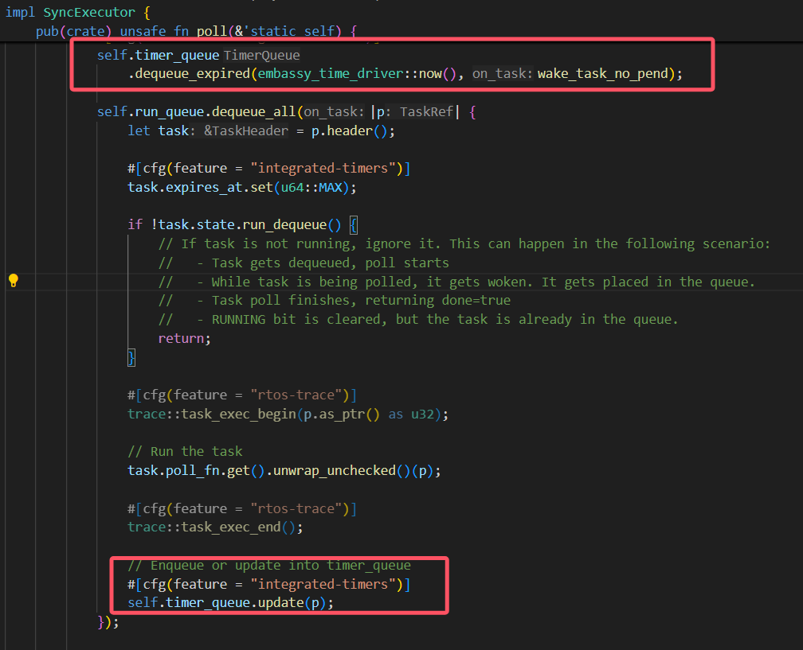


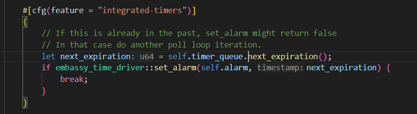

通过观察，我发现仿照这种定时器思路，设置一个超时时间，这种方式下，差分链表没什么意义，因为不需要去更新每个tcb的等待时间，只需要保留tcb的expire的绝对时间即可。不过每次需要找到等待时间队列里面expire值最小的任务，如果不提前进行排序的话，就要遍历查找了。

我的感觉是维护一个有序链表更好，让链表的头结点存放最小expire的等待任务，这样超时出队的时候也很快，只需要依次弹出所有的超时任务，直到遇到一个非超时的就停止，同时找next_expiration的值也很简单，只需要在deque后，把链表头的任务的等待值给出即可。它唯一的开销就是在await的时候注册这样一个等待任务，但是这种开销本身和遍历查找类似，并且发生在程序运行时，而我们设计的这个时间更新情况，是发生在中断时，中断时的处理应该简单迅速，所以我决定有序链表更好。

那么我们需要和原来embassy变动的地方就主要是那几个时间链表的关键接口：

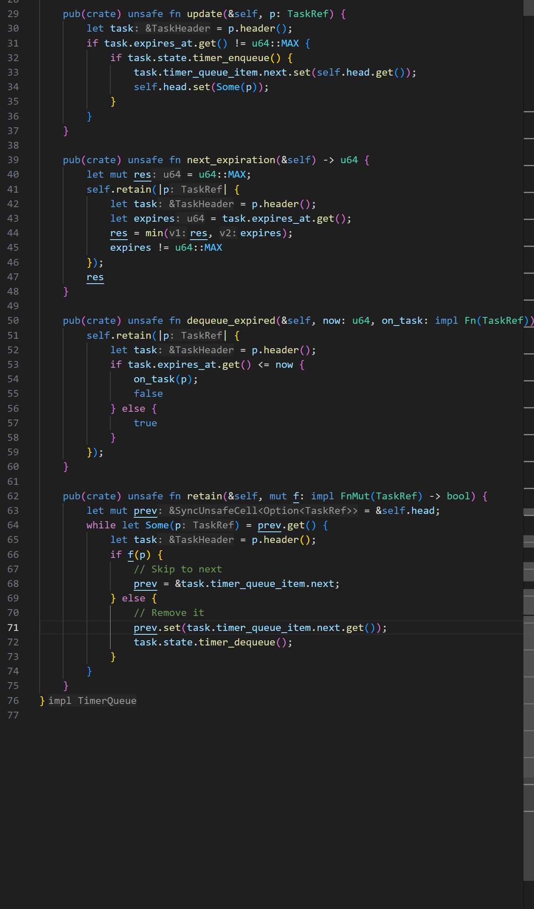

## 时钟中断的设计问题记录

如果是通过设置定时器的触发中断来实现定时唤醒，那不仅在普通的poll里面会这样设置时间


（我是拿一个变量set_time来表示目前定时器设置的中断触发时间点），同时还需要每次触发时钟中断后，马上也再设置下一次的中断唤醒时间点，

## 中断开发

[https://github.com/embassy-rs/stm32-data-generated/blob/63dcecb1b412ec6e7f872b652f6bf4809e0a94c2/stm32-metapac/src/chips/stm32f401re/pac.rs#L62](https://github.com/embassy-rs/stm32-data-generated/blob/63dcecb1b412ec6e7f872b652f6bf4809e0a94c2/stm32-metapac/src/chips/stm32f401re/pac.rs#L62)

这里是pac定义中断向量名称的地方。

有个问题是怎么实现

```rust
/// an async delay
pub fn OSTimeDly(_ticks: INT32U) {
    
}
```

普通的函数里面是不能使用await的，而事实上，我们不可能让delay一个函数做到和await一样的效果，因为await是需要编译器生成代码的时候针对代码的上下文生成相应的状态保存代码，而这不可能由一个函数在运行时做到。

# debug记录

## pendsv恢复栈出现问题：


但是上一步分给没有栈的新任务的模拟压栈是0x20001800

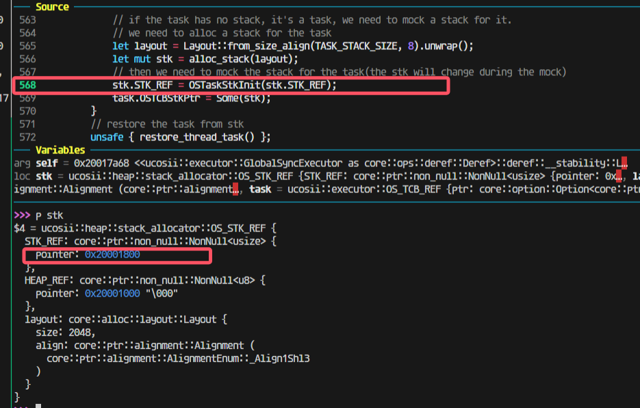


然后压栈完成后会变成17c0（因为有16个4字节寄存器压栈）


走进pendsv这一步还是对的，取出来的highrdy的栈是0x200017c0：

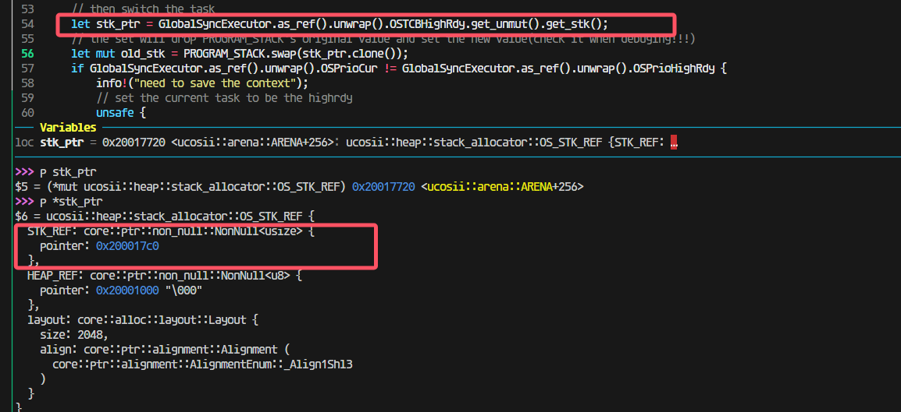

这一步出问题了；


找到原因：


这里我先把cur设置为了highrdy导致后面将上下文最终保存到cur任务的时候实际上保存错了位置，保存到highrdy的位置里面去了。所以应该修改为保存了上下文到cur任务后，再调整cur任务为higrdy任务：


改完后，到这里，栈pop出的值都是对的：

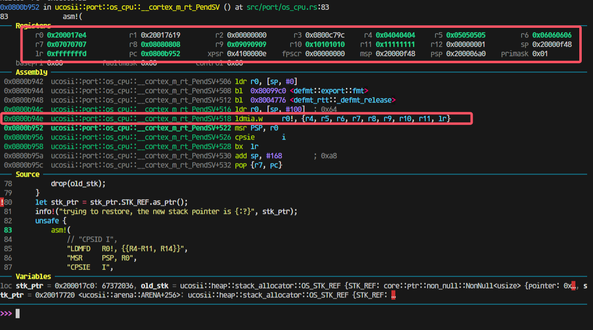

观察模拟压栈的内容：

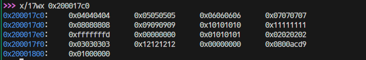

是完全正确的。

## 发现pendsv被连续触发，怀疑是需要清除什么中断标志


但是发现进入pendsv的时候PENDSVSET这一位就被清零了的


最后发现是新任务有栈（之前模拟压栈或者本身就有，导致进入poll之后就又跑去restore context了)：

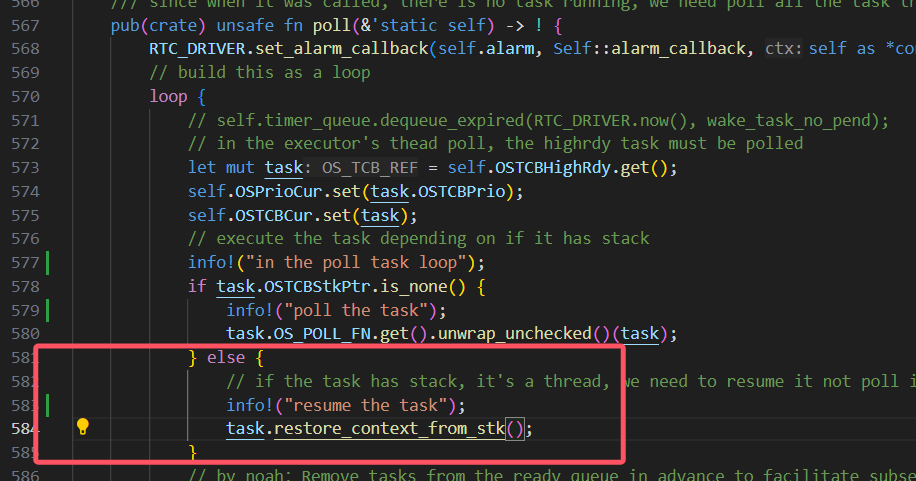

## 中断保存的lr有问题

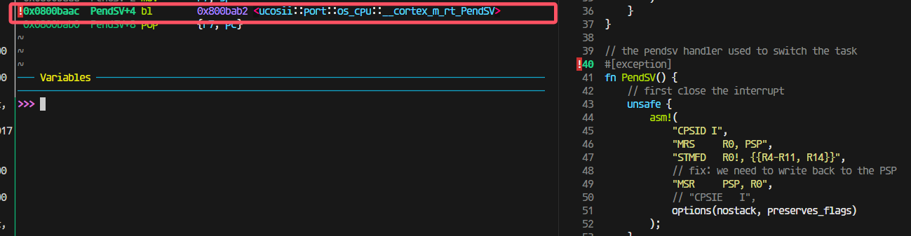

在进入中断的时候出现了问题，这里有个跳转才会进入我写的pendsv，那就会出现pendsv里面保存的lr是错误的。

所以我在想是不是开优化可以解决这个问题，做到不进行函数跳转。


果然如此

## 栈溢出

在进行模拟压栈时，由于没有考虑到满递减堆栈的前自减，导致最高地址的xpsr寄存器溢出：


使得堆分配器的元数据的hole的size成员被覆盖：

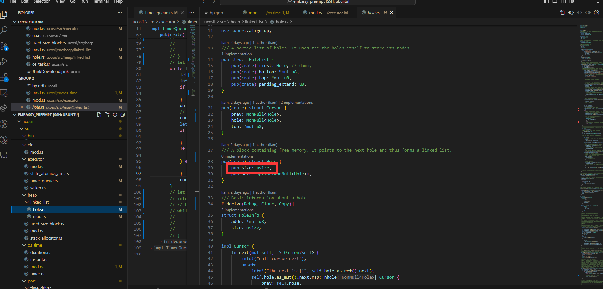

## 唤醒时的None

在alarm中断出现时，发现在对需要唤醒的任务引用调用wake方法时，出现自动解引用的None/unwrap异常

经过排查发现是dequeue中的set函数将导致头节点中的Some被覆盖为None：


因此我们将on_task函数的调用提前到set函数之前执行

## 唤醒错误

在alarm中断发生时，在多个任务需要等待的情况下，发现唤醒的任务错误。经过排查发现是update更新time_queue时出现错误，没有考虑到需要插入到队尾的情况，导致当某一个任务需要被插入到队尾时，会直接将头指针覆盖，使得被唤醒的任务不符合预期

## set_alarm的设计

我们采取使用循环set_alarm的方式实现alarm的设置：

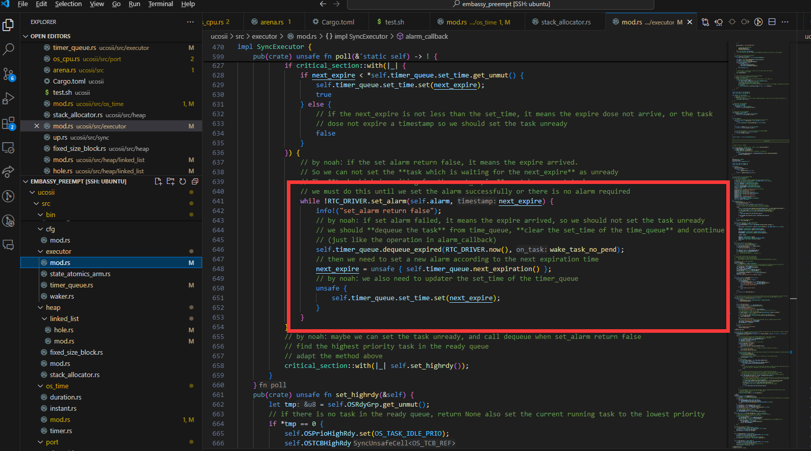

使用这种方式的主要原因如下：

> 就是假如说现在timequeue里面已经有一个任务（假如说叫任务1）正在延时，然后我现在有一个任务也需要延时，但是他在set_alarm的时候发现已经到了，set_alarm就会返回false，但是他并不会去设置输出比较通道的ccr寄存器。如果这个时候是if判断的话，那么现在这个执行流就会继续往下走了，但是这个时候alarm并没有被设置为任务1的延时时间点
> 

我们在讨论的过程中还出现了一种想法：

> 还有就是可能在原来任务延时的时候他的时钟设置就被设置了，然后在新任务发现超时了之后，由于没有对时钟配置进行修改，就会使得时钟还保留着原来任务的延时时间设置。这么看的话好像又不用重新set alarm一次。但是我刚刚重新看了一遍set alarm，他的timestamp是每次调用set alarm都会被设置的，所以好像还是要像poll里面那样用循环。但是讲道理这个对我们的影响应该不大，因为每次任务执行结束我们都会set一次alarm。但是我不知道embassy是怎么处理这个问题的，可能他也觉得影响不大就直接忽略了)
> 

我们认为在我们当前的系统中为了提高实时性，仍然需要采用循环的方式进行alarm的设置，因为：

> 在新任务出现超时时，仍然可能对原来的时钟配置进行修改
> 
> 
> 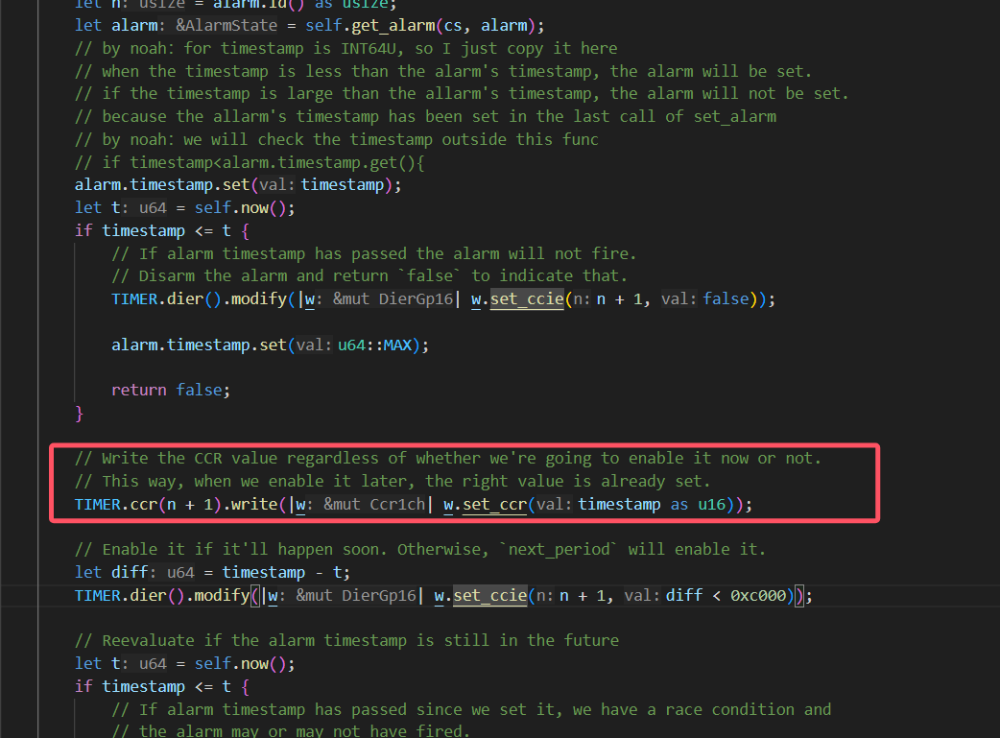
> 
> set_alarm有两次超时情况，第一次超时的确不会改变时钟配置，但是如果第一次检测没超时，但是设置了时钟后又超时，就会更改时钟
> 
> 
> 
> 。而且你后面说的timestamp的存在也确实导致需要通过这样的while循环来设置正确的时钟：
> 
> 
> 

## 神奇的ffi


这个时候就是把参数从R0开始作为第一个参数放置的位置

### 详细描述一下这个问题：

参数情况：

```toml
# cargo build --release
[profile.release]
codegen-units = 1
debug = 2  
opt-level = 0  
```

执行命令cargo build --release       

结果：

```bash
  Compiling ucosii v0.1.0 (/home/liam/learnRust/embassy_preempt/ucosii)
  Finished `release` profile [unoptimized + debuginfo] target(s) in 2.48s
```

用gdb-multiarch进行调试，调试代码：

尤其注意!!!返回值OS_ERR_STATE这里是4字节

```rust
 // os初始化
    OSInit();
    // 创建两个任务
    SyncOSTaskCreate(task1, 12 as *mut c_void, 11 as *mut usize, 10);
    ...
    
    //
pub trait ReturnUnitOrNeverReturn {}

impl ReturnUnitOrNeverReturn for ! {}
impl ReturnUnitOrNeverReturn for () {}
/// Create a task in uC/OS-II kernel. This func is used by C
// _ptos is not used in this func, because stack allocation is done by the stack allocator when scheduling
pub extern "aapcs" fn SyncOSTaskCreate<F, R>(task: F, p_arg: *mut c_void, _ptos: *mut OS_STK, prio: INT8U) -> OS_ERR_STATE
where
    // check by liam: why the future is 'static: because the definition of OS_TASK_STORAGE's generic F is 'static
    F: FnOnce(*mut c_void) -> R + 'static,
    R: ReturnUnitOrNeverReturn,
{
    // check the priority
    if prio > OS_LOWEST_PRIO as u8 {
        return OS_ERR_STATE::OS_ERR_PRIO_INVALID;
    }
    ...
}

```

看到对应的汇编部分（完整的给出传参部分的处理）

```bash
0x080031dc  preempt_test::__cortex_m_rt_test_basic_schedule+6  bl      0x8006344 <ucosii::os_core::OSInit>
0x080031e0  preempt_test::__cortex_m_rt_test_basic_schedule+10 movs    r0, #12
0x080031e2  preempt_test::__cortex_m_rt_test_basic_schedule+12 str     r0, [sp, #8]
0x080031e4  preempt_test::__cortex_m_rt_test_basic_schedule+14 movs    r1, #11
0x080031e6  preempt_test::__cortex_m_rt_test_basic_schedule+16 str     r1, [sp, #4]
0x080031e8  preempt_test::__cortex_m_rt_test_basic_schedule+18 movs    r2, #10
0x080031ea  preempt_test::__cortex_m_rt_test_basic_schedule+20 bl      0x8000d80 <ucosii::os_task::SyncOSTaskCreate>
//调用函数,包含部分传参
...
0x08000d80  ucosii::os_task::SyncOSTaskCreate+0  push  {r7, lr}
0x08000d82  ucosii::os_task::SyncOSTaskCreate+2  mov   r7, sp
0x08000d84  ucosii::os_task::SyncOSTaskCreate+4  sub   sp, #136        ; 0x88
0x08000d86  ucosii::os_task::SyncOSTaskCreate+6  str   r1, [sp, #28]
0x08000d88  ucosii::os_task::SyncOSTaskCreate+8  str   r0, [sp, #32]
0x08000d8a  ucosii::os_task::SyncOSTaskCreate+10 mov   r3, r2
0x08000d8c  ucosii::os_task::SyncOSTaskCreate+12 str   r3, [sp, #36]   ; 0x24
0x08000d8e  ucosii::os_task::SyncOSTaskCreate+14 str   r0, [sp, #76]   ; 0x4c
0x08000d90  ucosii::os_task::SyncOSTaskCreate+16 str   r1, [sp, #80]   ; 0x50
0x08000d92  ucosii::os_task::SyncOSTaskCreate+18 strb.w        r2, [r7, #-49]
0x08000d96  ucosii::os_task::SyncOSTaskCreate+22 movs  r0, #0
0x08000d98  ucosii::os_task::SyncOSTaskCreate+24 strb.w        r0, [r7, #-62]
0x08000d9c  ucosii::os_task::SyncOSTaskCreate+28 movs  r0, #1
0x08000d9e  ucosii::os_task::SyncOSTaskCreate+30 strb.w        r0, [r7, #-62]
0x08000da2  ucosii::os_task::SyncOSTaskCreate+34 cmp   r2, #63 ; 0x3f
0x08000da4  ucosii::os_task::SyncOSTaskCreate+36 bhi.n 0x8000df0 <ucosii::os_task::SyncOSTaskCreate+112>
0x08000da6  ucosii::os_task::SyncOSTaskCreate+38 b.n   0x8000da8 <ucosii::os_task::SyncOSTaskCreate+40>
0x08000da8  ucosii::os_task::SyncOSTaskCreate+40 ldr   r0, [sp, #32]
0x08000daa  ucosii::os_task::SyncOSTaskCreate+42 movs  r1, #0
```

可以观察到，参数的值来源于栈，下图给出了gdb-multiarch里面的变量信息（执行到0x08000da2  ucosii::os_task::SyncOSTaskCreate+34 cmp   r2, #63 ; 0x3f）

可以看到变量值都是对的（task的值为0xc40这里不太懂为什么）。

```bash
─── Variables ───────────────────────────────────────────────────────────────────────────────────────────────────────────────────────────────────────────────────────────────────────────────────────────────────────────────────────────────────────────────────────────────
arg task = 0xc40: {fn (*mut core::ffi::c_void)} 0xc40, p_arg = 0xc: (core::ffi::c_void::__variant2 | unknown: 204), _ptos = 0xb: 14994696, prio = 10
```

当我们把返回值OS_ERR_STATE改为8字节的时候，就开始出现问题：

```rust
0x08000eaa  ucosii::os_task::SyncOSTaskCreate+0  push  {r7, lr}
0x08000eac  ucosii::os_task::SyncOSTaskCreate+2  mov   r7, sp
0x08000eae  ucosii::os_task::SyncOSTaskCreate+4  sub   sp, #128        ; 0x80
0x08000eb0  ucosii::os_task::SyncOSTaskCreate+6  str   r2, [sp, #24]
0x08000eb2  ucosii::os_task::SyncOSTaskCreate+8  str   r1, [sp, #28]
0x08000eb4  ucosii::os_task::SyncOSTaskCreate+10 str   r0, [sp, #32]
0x08000eb6  ucosii::os_task::SyncOSTaskCreate+12 mov   r0, r3
0x08000eb8  ucosii::os_task::SyncOSTaskCreate+14 str   r0, [sp, #36]   ; 0x24
0x08000eba  ucosii::os_task::SyncOSTaskCreate+16 str   r1, [sp, #72]   ; 0x48
0x08000ebc  ucosii::os_task::SyncOSTaskCreate+18 str   r2, [sp, #76]   ; 0x4c
0x08000ebe  ucosii::os_task::SyncOSTaskCreate+20 strb.w        r3, [r7, #-45]
0x08000ec2  ucosii::os_task::SyncOSTaskCreate+24 movs  r0, #0
0x08000ec4  ucosii::os_task::SyncOSTaskCreate+26 strb.w        r0, [r7, #-58]
0x08000ec8  ucosii::os_task::SyncOSTaskCreate+30 movs  r0, #1
0x08000eca  ucosii::os_task::SyncOSTaskCreate+32 strb.w        r0, [r7, #-58]
0x08000ece  ucosii::os_task::SyncOSTaskCreate+36 cmp   r3, #63 ; 0x3f
```

刚进入函数的时候，寄存器的值如下

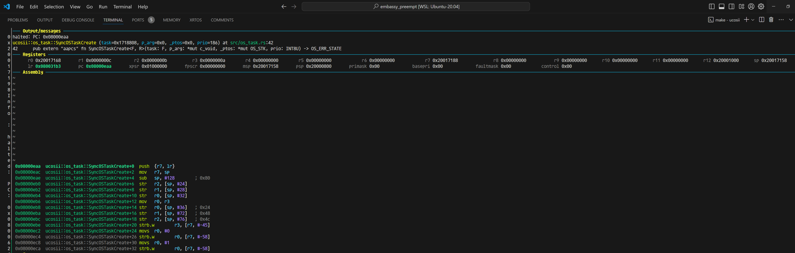

对比两次反汇编，能看到最大的不同有两个：

1. 除了task参数，其他参数在4字节返回值的时候是放在r0 r1 r2的，而8字节的时候是放在r1 r2 r3的
2.  sub   sp, #136        ; 0x88这里是返回值为8字节的时候，比4字节在栈的使用上，多用了4字节。

同样走到cmp r3,#63的位置，这个时候看变量的值：

```bash
─── Variables ──────────────────────────────────────────────────────────────────────────────────────────────────────────────────────────────────────────────────────────────────────────────────────────────────────────────────────────────────────────────────────────────────────────────────────────────────────────
arg task = 0xc00: {fn (*mut core::ffi::c_void)} 0xc00, p_arg = 0xc: (core::ffi::c_void::__variant2 | unknown: 112), _ptos = 0xb: 14971144, prio = 10s
```

同样是正常的。

相同的方式，我们将优化等级开到o1，保持8字节的OS_ERR_STATE返回值

同样进入函数时可以看到寄存器的值（同时变量的值也是正确的）：

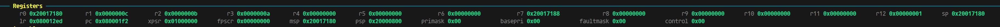


由于优化，直接把最开始的判断prio部分去掉了，因为测试里面没有大于64的情况（并且测试发现，即使有这种情况，也会优化掉）。


到这一步都是完全符合预期的，8字节的内容并没有影响到gdb-multiarch对于变量值的解析，只是参数的处理上有些变化，于是，我进一步有一个猜想，如果我按照aapcs的abi标准调用SyncOSTaskCreate, 是否可能出现在c语言那边调用rust库那样的问题：

这里是开优化（完全符合aapcs的规范，除了R0没有使用，R1-R3放了前三个参数，第四个参数就放进了栈里面）


一切正常，上图是开优化的结果

不开优化（同样参数完全正确，并且完全符合aapcs的规范，除了R0没有使用，R1-R3放了前三个参数，第四个参数就放进了栈里面）：

ps: 这里你能注意到r0的值是进入函数之前，保存的栈的值，对应汇编add sp, #8(不明白为什么这里需要这条指令)


而我们只调整返回值为4字节看看：

开优化下，你可以看到这里的值完完全全符号正宗的aapcs规范：

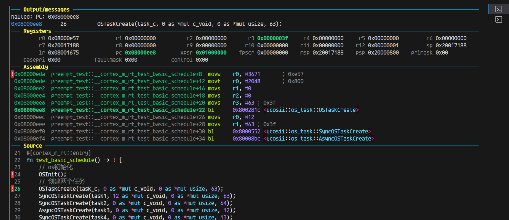

那说明在rust的这边（ap文件也是rust写的），是的确都正确的，那我们返回去看看c代码调用rust的静态库出的问题：

### 回到c ffi的问题


如果返回值OS_ERR_STATE是4字节，那么这个是正常合理的结果，传参放在r0-r3四个参数正好都能放在寄存器里面

但是如果我将返回值OS_ERR_STATE改为8字节：

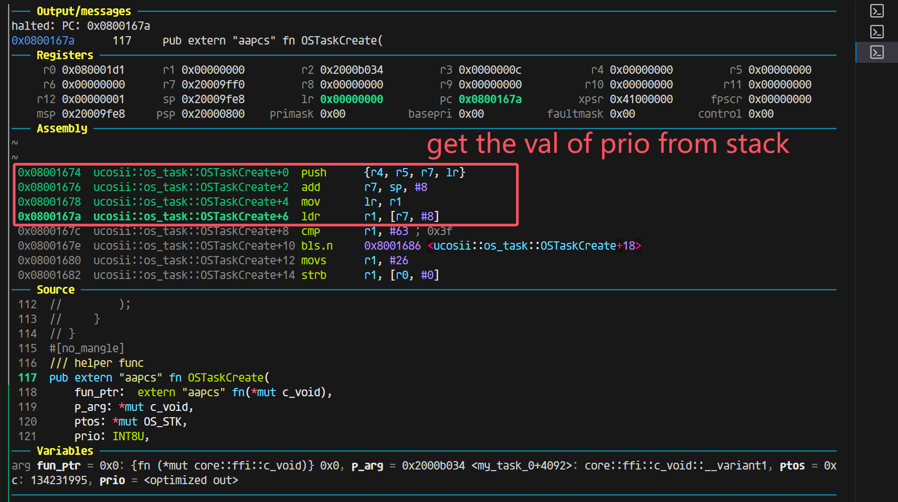

终于能解释这里问题的原因了：

因为rustc编译器对于64字节（在aapcs的abi情况下）的处理就是：

将r0保留(目前不知道为什么不使用r0,并且进入函数之前，设置r0的值为add  r0, sp, #8), 然后同样参数依次传递到r1(第一个参数) r2(第二个参数) r3(第三参数) 以及栈上(第四个以及之后的参数)。这种abi模式的情况和gcc的不兼容，我后续尝试声明c的extern函数的返回值为64位，但是它并没有在传参上做特殊处理，但是我仍然疑惑的是，为什么在网上没有查到rustc编译器对于这部分的特殊处理，或者说aapcs有规定这部分的处理吗？

## 关于抢占的细节问题

当一个任务被抢占，现场保留到栈上，当它在恢复的时候，如果又被抢占了，同样上下文保存在栈里面，然后在再一次恢复的时候，只恢复到第二次被抢占的位置，并且第一次被抢占时保留的上下文都清除了，这就导致了bug。

更简明的说法是，原本任务的interrupt poll是抢占了一个无栈的协程，但是现在出现有可能抢占的是一个有栈的线程的情况

一个解决方法是，避免这种抢占的发生，改进pendsv和poll的实现

poll在resume线程（有栈）任务的时候，不再设置cur与highrdy一致，这样当进入pendsv的时候，cur与highrdy必然不等，在TCB里面新加入一个成员变量：is_in_thread_poll用于标记任务是在协程状态还是线程状态，这个值用于在pendsv里面判断是否需要保存当前任务上下文。

这种情况下，不可能会抢占一个有栈的线程，因为当cur任务被设置为有栈的线程这种情况是在pendsv里面进行的，而在外部正常程序运行的时候，所有任务都被看成是无栈的协程在运行，不会存在在thread模式下，cur task是有栈的。

### bug补充

还会存在一种丢失唤醒的情况，这是因为在当前任务（假设优先级为35）delay时，设置加入1ns延迟，然后切换到idle任务去执行（目前所有任务都在delay），然而正在切换的过程中，就发生了TIM的时钟中断，将当前任务唤醒，并且dequeue了所有任务（也就是此时所有任务都就绪了），然后设置超时时间就顺其自然的设置为u64 max，因为所有任务都就绪了，

下图的task18的优先级就是35

```toml
└─ ucosii::executor::{impl#10}::set_highrdy @ src/executor/mod.rs:694 
INFO  ---task18 end---
└─ comprehensive_test::task18 @ src/bin/comprehensive_test.rs:352 
TRACE OSTimeDly
└─ ucosii::os_time::OSTimeDly @ src/os_time/mod.rs:25  
TRACE set_task_unready
└─ ucosii::executor::{impl#10}::set_task_unready @ src/executor/mod.rs:729 
INFO  in delay_tick the next expire is 489460
└─ ucosii::os_time::delay_tick @ src/os_time/mod.rs:42  
TRACE set_alarm
└─ ucosii::port::time_driver::{impl#4}::set_alarm @ src/port/time_driver/mod.rs:329 
INFO  set the alarm at 489460
└─ ucosii::port::time_driver::{impl#4}::set_alarm @ src/port/time_driver/mod.rs:330 
TRACE set_highrdy
└─ ucosii::executor::{impl#10}::set_highrdy @ src/executor/mod.rs:694 
TRACE interrupt_poll
└─ ucosii::executor::{impl#10}::interrupt_poll @ src/executor/mod.rs:573 
INFO  interrupt poll :the highrdy task's prio is 63
└─ ucosii::executor::{impl#10}::interrupt_poll @ src/executor/mod.rs:579 
TRACE TIM3
└─ ucosii::port::time_driver::TIM3 @ src/port/time_driver/mod.rs:46  
INFO  the alarm is triggered!!!
└─ ucosii::port::time_driver::{impl#3}::on_interrupt::{closure#0} @ src/port/time_driver/mod.rs:244 
TRACE trigger_alarm
└─ ucosii::port::time_driver::{impl#3}::trigger_alarm @ src/port/time_driver/mod.rs:281 
TRACE alarm_callback
└─ ucosii::executor::{impl#10}::alarm_callback @ src/executor/mod.rs:472 
INFO  dequeue expired
└─ ucosii::executor::timer_queue::{impl#0}::dequeue_expired @ src/executor/timer_queue.rs:67  
TRACE wake_task_no_pend
└─ ucosii::executor::wake_task_no_pend @ src/executor/mod.rs:766 
TRACE set_alarm
└─ ucosii::port::time_driver::{impl#4}::set_alarm @ src/port/time_driver/mod.rs:329 
INFO  set the alarm at 18446744073709551615
└─ ucosii::port::time_driver::{impl#4}::set_alarm @ src/port/t
TRACE IntCtxSW
└─ ucosii::executor::{impl#10}::IntCtxSW @ src/executor/mod.rs:539 
TRACE find_highrdy_prio
└─ ucosii::executor::{impl#10}::find_highrdy_prio @ src/executor/mod.rs:717 
INFO   the new_prio is 35, the highrdy task's prio is 63, the cur task's prio is 35
└─ ucosii::executor::{impl#10}::IntCtxSW::{closure#0} @ src/executor/mod.rs:543 
INFO  no need to switch task
└─ ucosii::executor::{impl#10}::IntCtxSW::{closure#0} @ src/executor/mod.rs:551 
TRACE exit TIM3
```